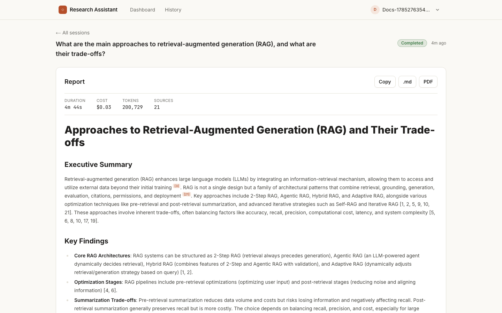
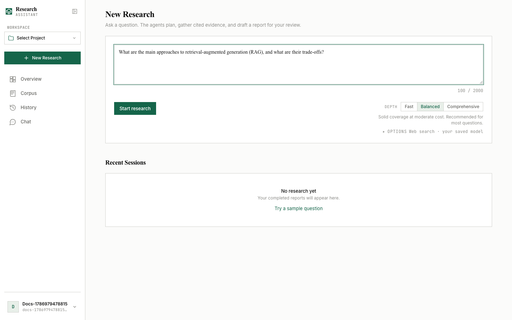
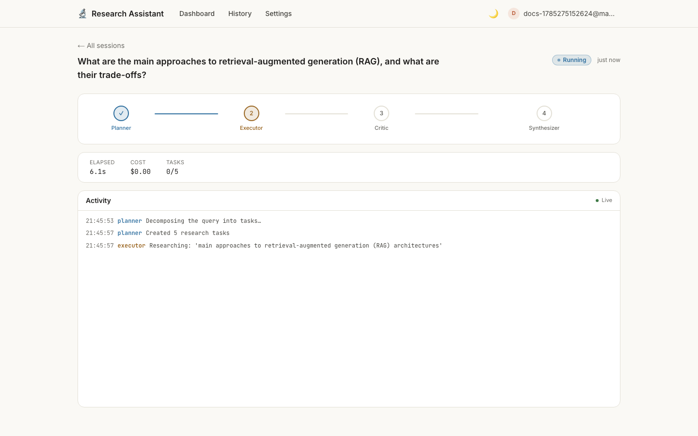
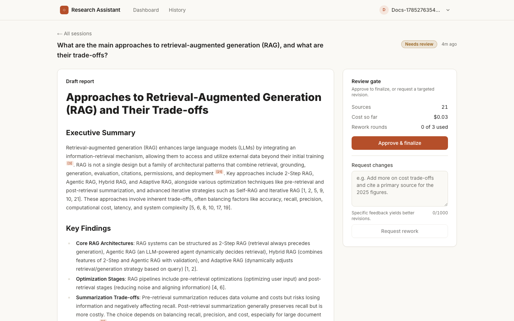
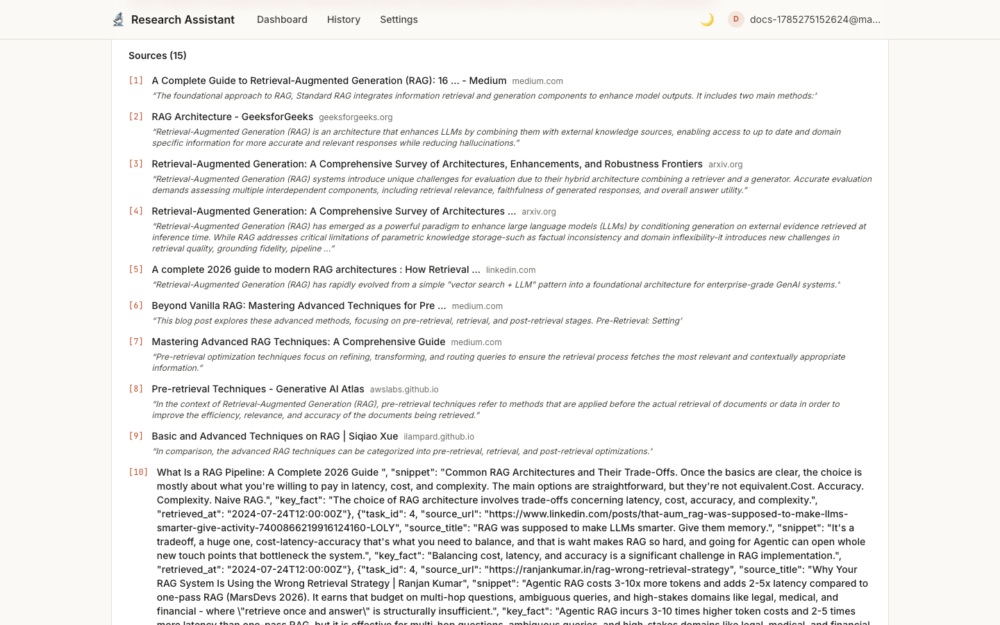
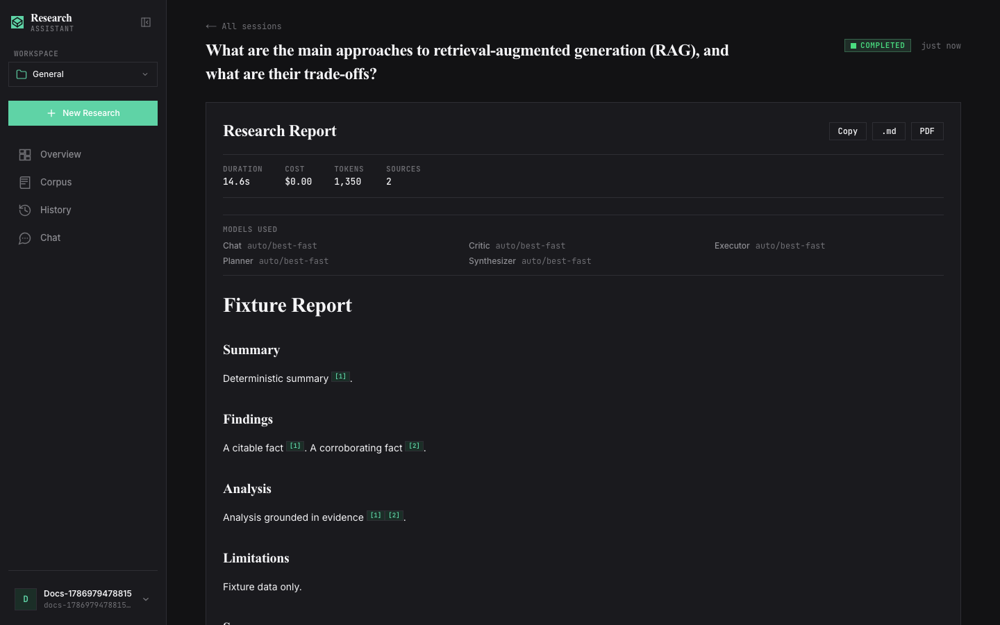
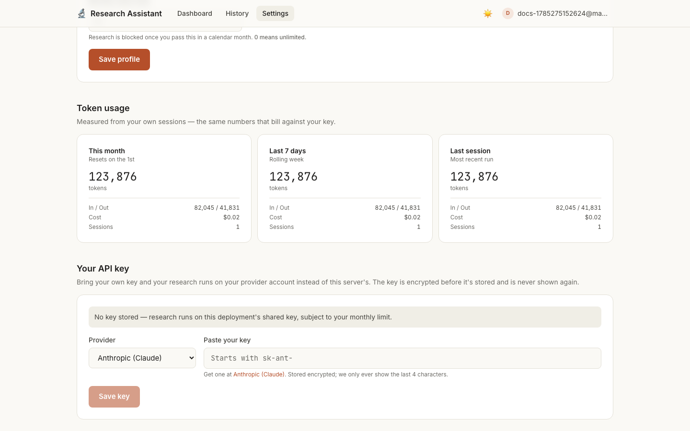
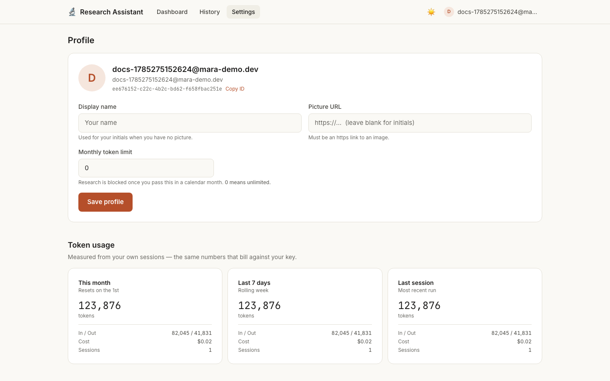

# Multi-Agent Research Assistant

> A self-hostable, bring-your-own-key research assistant with an auditable
> human-in-the-loop approval gate and verifiable per-claim citations.

[](https://github.com/adityamhaske/Multi-Agent-Research-Assistant/actions/workflows/ci.yml)
[](backend/evals/results/eval-2026-08-03.json)
[](LICENSE)
[](CONTRIBUTING.md)

Ask a research question. A pipeline of specialized agents (**Planner → Executor → Critic
→ Synthesizer**) searches the web, gathers evidence with sources, drafts a cited report,
and **pauses for your approval** before finalizing. Approve it, or send it back with
feedback. Completed reports support grounded follow-up chat and `.md` / `.pdf` export.

Every claim carries an inline `[n]` citation that resolves to a real source with the
verbatim supporting snippet. A citation that *doesn't* resolve renders as a visible ⚠
"unverified" chip — the system surfaces its own failures instead of hiding them.



---

## How it works

The pipeline is a compiled [LangGraph](https://langchain-ai.github.io/langgraph/)
`StateGraph`. Each agent has one job, and the graph's conditional edges enforce budgets
and retries. Screenshots below are the real product, captured from an actual run.

```
                    ┌──────────────────── rework (bounded) ─────────────────┐
                    ▼                                                       │
  Query → Planner → Executor ⇄ Critic → Synthesizer → ⏸ HUMAN GATE → Finalizer → Report
                    (tools)   (fail-   (cited draft)   (approve /            (+ chat,
                              closed)                   send back)            export)
```

### 1 · Ask a question

Pick a depth — `fast`, `balanced`, or `comprehensive`. Depth controls how many research
tasks the planner creates and therefore how much the run costs.



### 2 · Watch the agents work

The **Planner** decomposes your question into research tasks. For each task the
**Executor** runs real tool calls (`web_search`, `read_webpage`) and returns structured
evidence. The **Critic** grades that evidence and **fails closed** — invalid or missing
critic output counts as a failure, never a pass — sending weak tasks back to the Executor
up to a bounded retry limit.

The live monitor streams every node event over SSE, with durable replay: reconnect
mid-run and you lose nothing, because events are persisted to `agent_logs` and replayed
with `Last-Event-ID` before the live tail resumes.



### 3 · Review before it's final

The **Synthesizer** compiles a cited draft, then the graph hits `interrupt()` — a real
LangGraph checkpoint pause, not a polling loop. The session's state is durably
checkpointed in Postgres and the worker exits.

You get the draft beside a decision panel: source count, cost so far, and how many rework
rounds remain. **Approve** finalizes it; **request rework** sends your feedback back to
the Synthesizer. Either way the run **resumes from the checkpoint** — it never re-runs
research you already paid for.



### 4 · Verify every claim

Each `[n]` marker is a chip you can hover for the source title, domain, and the **verbatim
snippet that supports that claim**. The sources panel lists all of them with links.



Then ask follow-up questions in a chat grounded in the report and its sources, or export
to Markdown or PDF.

### 5 · Both themes are first-class

Light by default; dark mirrors the Claude Code palette. Every color is a design token —
no hardcoded hex — and both themes are checked for WCAG AA contrast.



---

## Bring your own key

Users can paste their own provider key and run research on their own account. The key is
**encrypted at rest** (Fernet/AES), never returned by any endpoint, and never sent back to
the browser — the UI only ever shows the last four characters.



Supported providers: **Anthropic (Claude)**, **Google (Gemini)**, and **OpenAI**. A user
without a key falls back to the deployment's shared server key, subject to their monthly
token limit.

### Account: Profile and Settings

The account area splits along a clean line. **Profile** is identity — display name, photo
(or generated initials), email, and password change. **Settings** is operation — token
usage, your API key, spending limit, and appearance. Both live behind the avatar menu in
the top bar, which shows your picture and first name only.



Set a **monthly token limit** (`0` = unlimited) to cap spend. Research is blocked with a
clear message once an account passes it, and resets on the 1st.

### Deploying for public use

For a deployment where strangers sign up, the intended shape is: users bring their own
keys, and the shared server key is either absent or tightly capped.

```bash
# .env
ENVIRONMENT=production          # Secure cookies, /docs disabled
DEFAULT_MONTHLY_TOKEN_LIMIT=50000   # applied to every new account
ENCRYPTION_KEY=<openssl rand -hex 32>   # encrypts users' stored keys
# Leave GOOGLE_API_KEY / ANTHROPIC_API_KEY unset to require BYOK from everyone.
```

Then put a TLS reverse proxy in front (see [`deploy/Caddyfile`](deploy/Caddyfile)) and read
the security checklist in [docs/engineering/06_Security.md](docs/engineering/06_Security.md).

> **`ENCRYPTION_KEY` is what protects your users' API keys.** If unset it derives from
> `JWT_SECRET_KEY`, which works but means rotating your JWT secret makes every stored key
> undecryptable (users are prompted to re-enter, nothing crashes). Set it explicitly in
> production so the two rotate independently.

---

## Quick start — one command

Prerequisites: Docker with Compose v2.

```bash
./start.sh
```

That's it. The script creates `.env` if missing (generating a JWT secret), checks your
config, builds and starts all five services, waits until every one reports healthy, and
opens the app.

```bash
./start.sh --fake      # keyless demo — no API key needed
./start.sh --logs      # start, then follow logs
./start.sh --stop      # stop (data preserved)
./start.sh --reset     # stop and delete all data (asks first)
```

Prefer to drive compose yourself:

```bash
cp .env.example .env
# In .env set:  JWT_SECRET_KEY=$(openssl rand -hex 32)
# Then either a server key (GOOGLE_API_KEY / ANTHROPIC_API_KEY),
# or LLM_MODE=fake for a keyless demo with deterministic fixtures.

docker compose -f docker-compose.full.yml up --build
```

Open **http://localhost:3000** → register → ask a question → watch the pipeline → approve
→ read the cited report.

The API container runs `alembic upgrade head` before serving, and the worker and frontend
wait on its readiness, so migrations apply exactly once, automatically. **The frontend is
the only published service** — it proxies `/api/*` internally, so auth cookies stay
first-party and the database is never exposed.

> `LLM_MODE=fake` needs no API keys at all: scripted models and fixture sources let you
> exercise the whole flow — pipeline, gate, citations, chat, export — for free.

### Native development

```bash
make infra-up                              # Postgres + Redis only
make backend-setup && make migrate
make backend-dev                           # API  → :8000  (/docs in dev)
make worker                                # Celery worker (new terminal)
make frontend-setup && make frontend-dev   # UI   → :3000  (new terminal)
```

```bash
make compose-up / compose-down / compose-logs   # full stack
make test / test-backend / test-frontend        # pytest + Vitest
make eval                                       # report-quality eval suite
make lint / format
```

---

## Architecture

- **Backend** — FastAPI + Celery worker, PostgreSQL 16, Redis 7
- **Agents** — LangGraph `StateGraph` with Postgres checkpointing; HITL via `interrupt()`
  so approval resumes rather than restarts; structured Pydantic outputs; fail-closed
  critic; per-session cost and wall-clock budgets
- **LLMs** — BYOK and provider-pluggable via `MODEL_*` routing (`provider:model`).
  `LLM_MODE=fake` swaps in scripted models for tests and demos
- **Search** — Tavily → Brave → DuckDuckGo fallback chain, Redis-cached, with an SSRF
  guard on page fetching and untrusted-content framing around everything the web returns
- **Frontend** — Next.js 16 (App Router), Tailwind v4, TanStack Query; same-origin `/api`
  proxy so cookies stay first-party and SSE authenticates natively
- **Security** ([docs/06](docs/engineering/06_Security.md)) — httpOnly cookie auth with rotating
  refresh tokens and reuse detection, per-operation atomic rate limits, encrypted BYOK
  keys, security headers, strict CSP

## Configuration

Every variable is documented in [`.env.example`](.env.example) and validated at startup —
the app refuses to boot with a placeholder or short `JWT_SECRET_KEY`, and in production it
verifies every routed model provider has a key.

| Variable | Required | Notes |
|---|---|---|
| `JWT_SECRET_KEY` | ✅ | ≥ 32 random chars (`openssl rand -hex 32`) |
| `DATABASE_URL`, `REDIS_URL` | ✅ | Set for you by the full-stack compose |
| `LLM_MODE` | ⚪ | `real` (default) or `fake` (keyless, deterministic) |
| `GOOGLE_API_KEY` / `ANTHROPIC_API_KEY` | with matching routing | Server key; users may BYOK instead |
| `MODEL_PLANNER` … `MODEL_CHAT` | ⚪ | `provider:model` per agent role |
| `ENCRYPTION_KEY` | ⚪ (recommended in prod) | Encrypts users' stored keys; defaults to deriving from `JWT_SECRET_KEY` |
| `DEFAULT_MONTHLY_TOKEN_LIMIT` | ⚪ | Token cap for new accounts; `0` = unlimited |
| `MAX_COST_PER_SESSION_USD` | ⚪ | Hard per-session budget (default `0.50`) |
| `ENVIRONMENT` | ⚪ | `development` or `production` (Secure cookies, `/docs` off) |

## Testing ([docs/08](docs/engineering/08_Testing_and_Quality.md))

- **Backend** — pytest: unit, pipeline (fake-LLM graph), and integration suites; migrations
  run on every CI run
- **Frontend** — Vitest (SSE parser, citation renderer, derivations) + `next build`
- **Golden E2E** — three Playwright journeys through the packaged stack in fake-LLM mode
- **Evals** — `make eval` scores a fixed query set and writes dated JSON to
  `backend/evals/results/`, so report quality is diffable over time. `make eval` runs in
  fake mode (free, deterministic); `LLM_MODE=real make eval` measures real-model quality

## Measured quality

Most projects in this category claim citation fidelity. Here are the numbers, the method,
and the failures — measured, not asserted.

Latest real-model run: [`eval-2026-08-03.json`](backend/evals/results/eval-2026-08-03.json),
10 queries across 10 domains.

| Metric | Result |
|---|---|
| Reports completed | **10 / 10** |
| Citation support rate | **95.2%** — cited sentences whose cited snippets actually support them |
| Citation resolution rate | **96.2%** — inline `[n]` markers pointing at a real source |
| Uncited claims | 5.9 per report (avg) |
| Cost | **$0.026** per report |
| Latency | 114 s per report |

**Method.** Models: `gemini-2.5-flash` for every role. Search: Tavily. Citation support is
judged per *sentence* by an LLM shown only the snippets that sentence cites, answering
YES/NO. Every run records its own method block, and `metrics_version` is bumped whenever a
definition changes so two runs are never silently compared across incompatible metrics.

**Limitations, stated plainly.** The support rate is **self-judged** — the grader is the
same model family that wrote the report, not a human and not an independent model. It is
shown every snippet extracted from a cited source, so it answers "is this claim supported
by what we extracted from the source it cites?", which is a weaker question than "is this
claim true". Ten queries is a small set. Treat it as a regression signal, not a benchmark.

### The failures

In one of the ten runs, the synthesizer cited **21 source numbers that did not exist** —
markers pointing past the 6 real sources it had. That is a 3.1% failure rate across 673
total citations, and it is the single most important number here, because **every one of
those 21 rendered as a visible ⚠ "unverified" chip** instead of a silent broken link. The
system surfaced its own failure, which is the entire design goal.

Three bugs were found by the *first* real-model run and fixed before these numbers were
published — the run reported 32% support before any of them were known:

| | Bug | Impact |
|---|---|---|
| D1 | `[1, 3]` grouped citations matched by no parser | 50% of citations invisible in the UI — **no chip, no link, and no ⚠ either** |
| D3 | Only the first snippet per source was kept | A citation could show a quote supporting a *different* claim (~8 claims shared one snippet) |
| D2 | Executor rarely returns parsable evidence first try | Open — costs an extra model call per task; recovers via fallback |

Every one was invisible to a passing test suite, because the fake fixtures never produced
the shapes real models produce. Details in
[docs/12 → Defect log](docs/product/12_Launch_Plan.md).

## Deployment ([docs/09](docs/engineering/09_Deployment_and_Operations.md))

Single host plus a TLS reverse proxy in front of the frontend:

- [`deploy/README.md`](deploy/README.md) — **host the whole stack for $0/month** on an
  Oracle Cloud Always Free VM, HTTPS included, no domain required
- [`deploy/docker-compose.demo.yml`](deploy/docker-compose.demo.yml) — pulls prebuilt
  multi-arch images; nothing is compiled on the server
- [`deploy/Caddyfile`](deploy/Caddyfile) — automatic-HTTPS reverse proxy
- [`deploy/backup-postgres.sh`](deploy/backup-postgres.sh) — nightly `pg_dump` with cron
  and restore examples; one dump captures full state

Tagging `vX.Y.Z` triggers [`release.yml`](.github/workflows/release.yml), which builds and
pushes the api/worker/frontend images to GHCR and cuts a GitHub Release. Images are
multi-arch (`linux/amd64` + `linux/arm64`), so the same tag runs on an x86 server and on
a free Ampere VM. The workflow can also be run manually to publish images under a name of
your choosing without cutting a release.

## Documentation

**Start here for depth:** [`docs/deep-dive/`](docs/deep-dive/00_INDEX.md) — four documents
covering the [end-to-end system](docs/deep-dive/01_End_to_End_System.md) (stakeholders,
usage, architecture, a principal-engineer technical review, and what's genuinely novel),
the [HLD](docs/deep-dive/02_HLD.md), the [LLD](docs/deep-dive/03_LLD.md), and an
[interview defense](docs/deep-dive/04_Interview_Defense.md) with post-mortems of the four
production bugs found by actually running the system.

The build contract:

[Vision](docs/product/01_Product_Vision.md) ·
[Architecture](docs/architecture/02_System_Architecture.md) ·
[Tech Stack](docs/architecture/03_Tech_Stack.md) ·
[Agent Design](docs/architecture/04_Agent_Design.md) ·
[Data & API](docs/architecture/05_Data_and_API.md) ·
[Security](docs/engineering/06_Security.md) ·
[UI/UX](docs/product/07_UIUX_Guidelines.md) ·
[Testing](docs/engineering/08_Testing_and_Quality.md) ·
[Deployment](docs/engineering/09_Deployment_and_Operations.md) ·
[Roadmap](docs/product/10_Roadmap.md) ·
[Standards](docs/engineering/11_Engineering_Standards.md)

## License

[MIT](LICENSE) — free to use, modify, and self-host, commercially or otherwise.
