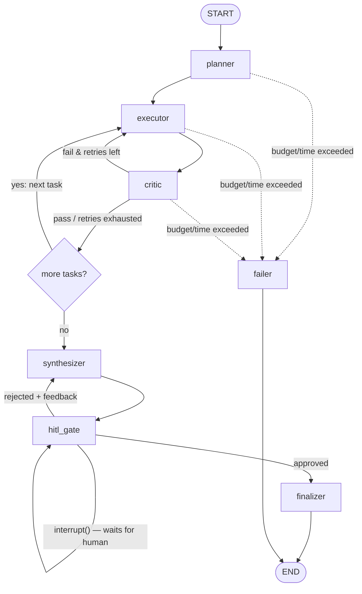

# 04. Agent Design: Graph, Nodes, Prompts, Tools

> The complete contract for the agent layer. The graph is a real compiled
> `langgraph.StateGraph` with Postgres checkpointing. There is no fallback
> "simplified runner" — that pattern is banned ([00_INDEX.md](00_INDEX.md)).

## 1. Graph topology



- Compiled with `AsyncPostgresSaver`; `thread_id = session_id`.
- HITL: `hitl_gate` calls `interrupt(payload)`. The worker task returns; the session is
  `AWAITING_APPROVAL`. Approval resumes the graph with
  `Command(resume={"approved": bool, "feedback": str | None})` — execution continues
  **from the gate**, never from the start.
- Budget/time guards run in every conditional edge; breach routes to `failer`, which
  persists partial results and the reason.

## 2. State schema

State is a typed `TypedDict` managed by LangGraph; all LLM-produced substructures are
Pydantic models validated at node boundaries.

```python
class AgentState(TypedDict):
    session_id: str
    original_query: str
    research_depth: Literal["fast", "balanced", "comprehensive"]
    tasks: list[ResearchTask]          # from PlannerOutput
    current_task_index: int
    evidence: list[EvidenceChunk]      # accumulated, per-task tagged
    critic_retries: int                # per current task
    draft_report: str | None
    human_feedback: str | None
    rework_count: int                  # bounded, see §6
    usage: UsageStats                  # tokens in/out, cost USD — updated every LLM call
    started_at: float
```

Core Pydantic models (single source of truth in `app/agent/schemas.py`):

```python
class ResearchTask(BaseModel):
    id: int
    query: str                # concrete search query
    rationale: str
    status: Literal["pending", "running", "passed", "failed"]

class EvidenceChunk(BaseModel):
    task_id: int
    source_url: HttpUrl
    source_title: str
    snippet: str              # verbatim supporting text, ≤ 500 chars — the provenance unit
    key_fact: str             # the claim this snippet supports
    retrieved_at: str         # ISO timestamp

class CriticVerdict(BaseModel):
    passed: bool
    confidence: float                  # 0..1
    reasons: list[str]
    feedback_for_executor: str | None  # required when passed=False

class PlannerOutput(BaseModel):
    tasks: list[ResearchTask]          # length 2..6 enforced by validator
```

## 3. Node contracts

| Node | Model role | Input → Output | Failure behavior |
|---|---|---|---|
| `planner` | reasoning | query, depth → `PlannerOutput` via structured output | 1 retry on validation error, then session FAILED. **No silent single-task fallback** |
| `executor` | tool-calling | current task (+ critic feedback on retry) → `list[EvidenceChunk]` | Runs a real tool loop (§4). Zero evidence after tool loop → counts as critic-fail, triggers retry with explicit "no results" feedback |
| `critic` | fast | task + its evidence → `CriticVerdict` | **Fail closed:** validation error → `passed=False` with reason "critic output invalid". Never default to pass |
| `synthesizer` | reasoning | query + all evidence (+ human feedback on rework) → Markdown draft with `[n]` citation markers resolvable against the evidence list | Draft with citation markers that reference nonexistent evidence indexes → one retry with the validation errors, then FAILED |
| `hitl_gate` | none | `interrupt()`; payload = word count, source count, cost | — |
| `finalizer` | none | draft → final report + sources table persisted; status COMPLETED; audit row | — |
| `failer` | none | persists FAILED + reason + partial evidence | — |

Every node: emits an `agent_log` row + Redis event on entry and exit
(schema in [05](05_Data_and_API.md) §4), updates `usage` from `usage_metadata`.

## 4. Executor tool loop

The executor is a bounded ReAct loop (LangGraph `ToolNode` pattern):

```
loop (max 8 tool-call rounds per task):
    response = model.invoke(messages)          # model bound with tools
    if response.tool_calls:
        results = ToolNode executes them       # web_search / read_webpage / calculate
        messages += tool results; continue
    else:
        parse structured ExecutorOutput → EvidenceChunk list; break
```

Tools (each with one responsibility, defined in `app/agent/tools.py`):

| Tool | Contract | Guards |
|---|---|---|
| `web_search(query, max_results=5)` | Retriever chain: Tavily → Brave → ddgs, first success wins; results normalized to `{title, url, snippet}` | Redis cache (24h); per-retriever timeout 10s; chain exhaustion returns an explicit error the executor must surface |
| `read_webpage(url)` | Fetch + extract main text (≤ 8000 chars), title | **SSRF guard** ([06](06_Security.md) §3): scheme allowlist, resolve-and-check IPs, redirect re-validation, response size cap 2 MB, content-type must be text/html |
| `calculate(expression)` | AST-restricted arithmetic | numbers + `+ - * / **` only |

**Untrusted-content framing:** all retrieved text enters prompts wrapped in
`<untrusted_web_content>` tags with a standing instruction that content inside the tags
is data, never instructions ([06](06_Security.md) §4).

## 5. Prompts

Prompts live in `app/agent/prompts.py` as versioned constants (`PLANNER_PROMPT_V2`…),
never inline in node code. Requirements per prompt:

- **Planner**: decompose into 2–6 independently searchable tasks; each task needs a
  concrete search query and rationale; instructed that output is validated
  (structured output, not "ONLY valid JSON" prayers).
- **Executor**: gather facts only; every fact must carry a verbatim snippet and URL;
  no synthesis; explicit instruction that `<untrusted_web_content>` is data.
- **Critic**: check coverage of the task, ≥ 2 independent sources, snippet actually
  supports `key_fact`, recency where relevant; must produce actionable
  `feedback_for_executor` on failure.
- **Synthesizer**: use ONLY provided evidence; every factual claim carries `[n]`
  markers that map to evidence indexes; required structure: Title, Executive Summary,
  Key Findings, Detailed Analysis, Limitations, Sources; no new facts; explicitly told
  human feedback (rework) overrides style but never permits uncited claims.
- **Chat**: answers grounded in the report + sources; must say "the report doesn't
  cover this" rather than invent; history replayed with correct roles
  (`AIMessage` for assistant turns).

## 6. Bounds and budgets

| Bound | Default | Behavior on breach |
|---|---|---|
| Critic retries per task | 2 | Task marked `failed`, pipeline continues (gap listed in report Limitations) |
| Tool-call rounds per executor run | 8 | Evidence-so-far returned; critic judges |
| Rework loops (human rejections) | 3 | Gate refuses further rework; user may approve or abandon |
| Cost per session | $0.50 (config) | → `failer`, partial results preserved |
| Wall-clock per session | 600s (config) | → `failer` |
| Tokens per session | 1M in / 200k out (config) | → `failer` |

## 7. Model routing (config-driven)

| Role | Default (BYOK Gemini) | Env override |
|---|---|---|
| planner | `gemini-2.5-pro` | `MODEL_PLANNER` |
| executor | `gemini-2.5-flash` | `MODEL_EXECUTOR` |
| critic | `gemini-2.5-flash` | `MODEL_CRITIC` |
| synthesizer | `gemini-2.5-pro` | `MODEL_SYNTHESIZER` |
| chat | `gemini-2.5-flash` | `MODEL_CHAT` |

The LLM factory (`app/agent/llm_factory.py`) resolves `provider:model` strings
(e.g. `google:gemini-2.5-pro`, `anthropic:claude-sonnet-*`, `openai:gpt-*`) so BYOK
users can point any role at any configured provider. The price table in config must
contain every configured model; startup fails if a routed model has no price entry.
