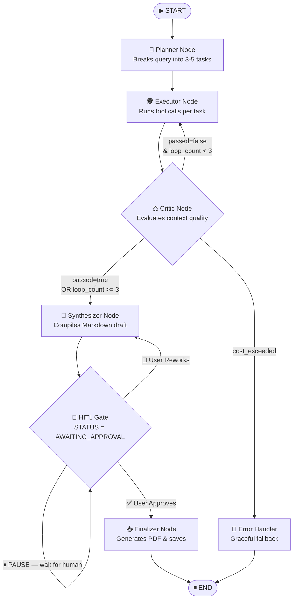

# 2. System Architecture

> **Purpose**: Defines the complete infrastructure topology, tech stack justification, state machine design, data flow, and scaling strategy for the Multi-Agent Research Assistant. This is the authoritative reference for all architectural decisions.

---

## Table of Contents
1. [Tech Stack & Justifications](#1-tech-stack--justifications)
2. [High-Level System Topology](#2-high-level-system-topology)
3. [The LangGraph State Machine](#3-the-langgraph-state-machine)
4. [End-to-End Data Flow](#4-end-to-end-data-flow)
5. [API Service Architecture](#5-api-service-architecture)
6. [Background Worker Architecture](#6-background-worker-architecture)
7. [Real-Time Communication Layer](#7-real-time-communication-layer)
8. [Infrastructure Scaling Strategy](#8-infrastructure-scaling-strategy)
9. [Security Architecture](#9-security-architecture)
10. [Observability Stack](#10-observability-stack)

---

## 1. Tech Stack & Justifications

| Layer | Technology | Version | Justification |
|---|---|---|---|
| **Frontend Framework** | React.js | 18+ | Component model maps directly to agent state panels; large ecosystem |
| **Frontend Styling** | TailwindCSS | 3.x | Rapid utility-first styling; dark mode support out-of-the-box |
| **Frontend State (Local)** | Zustand | 4.x | Lightweight store for UI state (active session, approval status) without Redux boilerplate |
| **Frontend State (Server)** | TanStack Query (React Query) | 5.x | Handles caching, refetching, and loading states for all REST calls |
| **Backend API** | FastAPI | 0.110+ | Native `async`/`await`, automatic OpenAPI docs, Pydantic v2 integration |
| **Agent Orchestration** | LangGraph | 0.2+ | Native graph state machine with conditional edges, checkpointing, and HITL interrupts |
| **LLM Chain Abstraction** | LangChain | 0.3+ | Standardized tool-calling interface across multiple LLM providers |
| **LLM Provider (Primary)** | Anthropic Claude 3.5 Sonnet | API | Best-in-class instruction following and JSON output; lower hallucination rate |
| **LLM Provider (Fallback)** | OpenAI GPT-4o | API | Fallback on Anthropic rate limits; strong function calling |
| **Web Search Tool** | Tavily API | v2 | Purpose-built for AI agents; returns cleaned, LLM-friendly context |
| **Database (Persistent)** | PostgreSQL | 15+ | ACID-compliant; UUID support; JSONB for flexible log storage |
| **ORM** | SQLAlchemy (Async) | 2.0+ | Native asyncpg driver support; type-safe column definitions |
| **Migrations** | Alembic | 1.13+ | Version-controlled schema changes; autogenerate from models |
| **Cache & Queue** | Redis | 7.x | Sub-millisecond state reads; pub/sub for SSE fan-out; Celery broker |
| **Background Jobs** | Celery | 5.x | Distributed task queue; scales independently from the API tier |
| **Containerization** | Docker + Docker Compose | Latest | Local development parity; multi-service orchestration |
| **Orchestration (Prod)** | Kubernetes (K8s) | 1.29+ | Horizontal pod autoscaling based on Redis queue depth |
| **Observability** | LangSmith + Prometheus + Grafana | Latest | LLM trace debugging + infrastructure metrics |
| **Auth** | JWT (via PyJWT) + OAuth2 | — | Stateless authentication; supports social login providers |

---

## 2. High-Level System Topology

```
┌─────────────────────────────────────────────────────────────────────┐
│                        CLIENT LAYER                                  │
│  ┌─────────────────────────────────────────────────────────────┐    │
│  │  React SPA (Vite)                                            │    │
│  │  ┌──────────────┐ ┌──────────────┐ ┌────────────────────┐  │    │
│  │  │ InputDashboard│ │ BrainMonitor │ │ HITLApprovalGate   │  │    │
│  │  └──────────────┘ └──────────────┘ └────────────────────┘  │    │
│  └─────────────────────────────────────────────────────────────┘    │
└───────────────────┬─────────────────────────────────────────────────┘
                    │ HTTPS / SSE / WebSocket
┌───────────────────▼─────────────────────────────────────────────────┐
│                    API GATEWAY LAYER                                 │
│  ┌─────────────────────────────────────────────────────────────┐    │
│  │  FastAPI (api-service) — Kubernetes Deployment              │    │
│  │  • Auth middleware (JWT validation)                          │    │
│  │  • Request validation (Pydantic v2)                          │    │
│  │  • SSE stream manager (Redis pub/sub fan-out)               │    │
│  │  • HITL approval webhook receiver                            │    │
│  └─────────────────────────────────────────────────────────────┘    │
└───────┬───────────────────────────────────┬─────────────────────────┘
        │ Enqueue task (Celery)              │ Read/Write
┌───────▼───────────┐               ┌───────▼────────────────────────┐
│  QUEUE LAYER       │               │  DATA LAYER                    │
│  Redis (Broker)   │               │  ┌──────────────────────────┐  │
│  • Celery tasks   │               │  │  PostgreSQL               │  │
│  • SSE channels   │               │  │  • users table            │  │
│  • Session locks  │               │  │  • sessions table         │  │
└───────┬───────────┘               │  │  • agent_logs table       │  │
        │ Consume                   │  └──────────────────────────┘  │
┌───────▼─────────────────────────┐ │  ┌──────────────────────────┐  │
│  AGENT WORKER LAYER             │ │  │  Redis (State Cache)      │  │
│  Celery Workers — K8s HPA       │ │  │  • Active graph snapshots │  │
│  ┌───────────────────────────┐  │ │  │  • HITL checkpoint data   │  │
│  │  LangGraph State Machine  │  │ │  └──────────────────────────┘  │
│  │  ┌────────┐ ┌──────────┐  │  │ └────────────────────────────────┘
│  │  │Planner │→│ Executor │  │  │
│  │  └────────┘ └────┬─────┘  │  │ ┌────────────────────────────────┐
│  │          ┌───────▼──────┐  │  │ │  EXTERNAL SERVICES             │
│  │          │    Critic    │  │  │ │  • Anthropic / OpenAI APIs     │
│  │          └───────┬──────┘  │  │ │  • Tavily Search API           │
│  │  ┌─────────────────────┐   │  │ │  • LangSmith Observability     │
│  │  │  HITL Interrupt Node│   │  │ └────────────────────────────────┘
│  │  └─────────────────────┘   │  │
│  │  ┌─────────┐               │  │
│  │  │Synth.   │               │  │
│  │  └─────────┘               │  │
│  └───────────────────────────┘  │
└─────────────────────────────────┘
```

---

## 3. The LangGraph State Machine

### 3.1 State Container Definition

```python
# app/agent/state.py
from typing import TypedDict, Optional

class Task(TypedDict):
    id: int
    query: str
    status: str  # "pending" | "running" | "passed" | "failed"

class ContextChunk(TypedDict):
    task_id: int
    content: str
    source_url: str
    retrieved_at: str  # ISO 8601 timestamp

class AgentState(TypedDict):
    # Identity
    session_id: str
    user_id: str

    # Research Input
    original_query: str
    research_depth: str  # "fast" | "balanced" | "comprehensive"
    selected_sources: list[str]

    # Planner Output
    tasks: list[Task]
    current_task_index: int

    # Executor / Critic Loop
    raw_context: list[ContextChunk]
    critic_feedback: Optional[dict]    # {"passed": bool, "reason": str, "feedback": str}
    critic_loop_count: int             # Tracks loops for circuit breaker

    # HITL Gate
    synthesized_draft: Optional[str]
    human_feedback: Optional[str]      # Populated when user clicks "Rework"

    # Output
    final_report: Optional[str]

    # Telemetry
    total_tokens_input: int
    total_tokens_output: int
    total_cost_usd: float
    elapsed_seconds: float

    # Error handling
    error: Optional[str]
    error_node: Optional[str]
```

### 3.2 Graph Node Definitions & Routing

```python
# app/agent/graph.py
from langgraph.graph import StateGraph, END
from langgraph.checkpoint.redis import AsyncRedisSaver

def build_agent_graph(checkpointer) -> CompiledGraph:
    builder = StateGraph(AgentState)

    # Add nodes
    builder.add_node("planner",     planner_node)
    builder.add_node("executor",    executor_node)
    builder.add_node("critic",      critic_node)
    builder.add_node("synthesizer", synthesizer_node)
    builder.add_node("hitl_gate",   hitl_gate_node)
    builder.add_node("finalizer",   finalizer_node)
    builder.add_node("error_handler", error_handler_node)

    # Define entry
    builder.set_entry_point("planner")

    # Static edges
    builder.add_edge("planner",     "executor")
    builder.add_edge("executor",    "critic")
    builder.add_edge("synthesizer", "hitl_gate")
    builder.add_edge("hitl_gate",   END)        # Pause here; resume via API
    builder.add_edge("finalizer",   END)

    # Conditional edges
    builder.add_conditional_edges(
        "critic",
        route_after_critic,
        {
            "executor":    "executor",     # Loop: critic failed, retry
            "synthesizer": "synthesizer",  # All tasks passed
            "error":       "error_handler" # Budget/loop limit exceeded
        }
    )
    builder.add_conditional_edges(
        "hitl_gate",
        route_after_hitl,
        {
            "approved": "finalizer",       # User approved draft
            "rework":   "synthesizer",     # User requested rework
        }
    )

    # Compile with Redis checkpointer for persistence
    return builder.compile(
        checkpointer=checkpointer,
        interrupt_before=["hitl_gate"]  # ← HITL pause point
    )
```

### 3.3 Graph Visualization (Mermaid)



---

## 4. End-to-End Data Flow

### Phase 1: Request Ingestion (< 100ms)

```
Client ──POST /api/v1/research/start──► FastAPI API Service
  payload: { query, depth, sources }
                │
                ├─ Validate input (Pydantic v2)
                ├─ Create Session record in Postgres (status=PENDING)
                ├─ Acquire session lock in Redis
                ├─ Enqueue `run_agent_pipeline.delay(session_id)` to Celery
                │
                └──► Return 202: { session_id, status: "PENDING" }
```

### Phase 2: Agent Execution (1–5 minutes, async)

```
Celery Worker picks up task
        │
        ├─ Load graph from Redis checkpoint (or create new)
        ├─ Update Postgres session: status=RUNNING
        ├─ Execute: Planner → Executor → Critic (loop ≤3x) → Synthesizer
        │
        Each node:
          ├─ Writes AgentLog to Postgres
          └─ Publishes SSE event to Redis pub/sub channel: session:{id}:logs
                │
        ┌───────▼────────────────────────────────────────────┐
        │ API Service (SSE Stream Endpoint)                   │
        │  GET /api/v1/research/{session_id}/stream           │
        │  Subscribed to Redis channel → forwards to client   │
        └───────────────────────────────────────────────────┘
```

### Phase 3: HITL Gate Pause

```
Synthesizer finishes draft
        │
        ├─ Save graph checkpoint to Redis (full state snapshot)
        ├─ Update Postgres session: status=AWAITING_APPROVAL, draft=<markdown>
        └─ Publish SSE event: { type: "HITL_READY", draft_preview: "..." }

Client UI receives HITL_READY event
        │
        └─ Renders split-screen HITL Approval Gate component
```

### Phase 4: Human Approval / Rejection

```
User clicks [Approve & Finalize]
        │
        └──► POST /api/v1/research/{session_id}/approve
               payload: { approved: true, feedback: "" }
                    │
                    ├─ Load graph checkpoint from Redis
                    ├─ Inject human_feedback into AgentState
                    ├─ Resume graph from hitl_gate node
                    └─ Finalizer node: generates PDF, updates session=COMPLETED
```

---

## 5. API Service Architecture

### 5.1 Project Structure

```
backend/
├── app/
│   ├── main.py                 # FastAPI app factory, middleware, routers
│   ├── config.py               # Pydantic Settings (reads from .env)
│   ├── dependencies.py         # Shared FastAPI Depends: db, redis, current_user
│   │
│   ├── api/
│   │   ├── v1/
│   │   │   ├── research.py     # Research start/status/stream/approve endpoints
│   │   │   ├── auth.py         # Login/register/refresh token endpoints
│   │   │   └── export.py       # PDF/DOCX export endpoints
│   │   └── router.py           # Aggregate all v1 routers
│   │
│   ├── agent/
│   │   ├── state.py            # AgentState TypedDict
│   │   ├── graph.py            # LangGraph builder and compile
│   │   ├── nodes/
│   │   │   ├── planner.py
│   │   │   ├── executor.py
│   │   │   ├── critic.py
│   │   │   ├── synthesizer.py
│   │   │   └── finalizer.py
│   │   ├── tools/
│   │   │   ├── search.py       # TavilySearch wrapper
│   │   │   ├── reader.py       # read_webpage tool
│   │   │   └── calculator.py   # calculate_metrics tool
│   │   └── callbacks.py        # CostTrackingCallback, LoggingCallback
│   │
│   ├── models/                 # SQLAlchemy ORM models
│   │   ├── user.py
│   │   ├── session.py
│   │   └── agent_log.py
│   │
│   ├── schemas/                # Pydantic v2 request/response schemas
│   │   ├── research.py
│   │   └── auth.py
│   │
│   ├── services/
│   │   ├── session_service.py  # Business logic for session CRUD
│   │   ├── sse_service.py      # Redis pub/sub SSE fan-out manager
│   │   └── export_service.py   # PDF/DOCX generation
│   │
│   ├── db/
│   │   ├── base.py             # SQLAlchemy Base, engine, session factory
│   │   └── redis.py            # Redis connection pool
│   │
│   └── workers/
│       ├── celery_app.py       # Celery app instance
│       └── tasks.py            # Celery task: run_agent_pipeline
│
├── alembic/                    # Database migrations
│   ├── env.py
│   └── versions/
│       └── 0001_initial_schema.py
│
├── tests/
│   ├── unit/
│   │   └── test_agent_nodes.py
│   └── integration/
│       └── test_research_endpoints.py
│
├── prompts/
│   └── v1/
│       ├── planner.py
│       ├── executor.py
│       ├── critic.py
│       └── synthesizer.py
│
├── .env.example
├── requirements.txt
└── Dockerfile
```

### 5.2 Core Application Setup

```python
# app/main.py
from contextlib import asynccontextmanager
from fastapi import FastAPI
from fastapi.middleware.cors import CORSMiddleware
from app.db.base import create_db_tables
from app.db.redis import init_redis_pool, close_redis_pool
from app.api.router import api_router

@asynccontextmanager
async def lifespan(app: FastAPI):
    """Startup and shutdown lifecycle hooks."""
    await create_db_tables()
    await init_redis_pool()
    yield  # Application runs here
    await close_redis_pool()

app = FastAPI(
    title="Multi-Agent Research Assistant API",
    version="1.0.0",
    description="Production-grade autonomous research synthesis system.",
    lifespan=lifespan,
)

app.add_middleware(
    CORSMiddleware,
    allow_origins=["http://localhost:5173"],  # Vite dev server
    allow_credentials=True,
    allow_methods=["*"],
    allow_headers=["*"],
)

app.include_router(api_router, prefix="/api/v1")
```

---

## 6. Background Worker Architecture

### 6.1 Celery Configuration

```python
# app/workers/celery_app.py
from celery import Celery
from app.config import settings

celery_app = Celery(
    "research_worker",
    broker=settings.REDIS_URL,
    backend=settings.REDIS_URL,
    include=["app.workers.tasks"],
)

celery_app.conf.update(
    task_serializer="json",
    result_serializer="json",
    accept_content=["json"],
    task_acks_late=True,           # Don't mark task done until it's committed
    worker_prefetch_multiplier=1,  # One task per worker at a time (LLM tasks are heavy)
    task_soft_time_limit=600,      # 10-min soft limit — task gets SIGTERM
    task_time_limit=660,           # 11-min hard limit — task gets SIGKILL
)
```

### 6.2 Agent Pipeline Task

```python
# app/workers/tasks.py
import asyncio
from app.workers.celery_app import celery_app
from app.agent.graph import build_agent_graph
from app.db.redis import get_redis_checkpointer

@celery_app.task(bind=True, max_retries=2, default_retry_delay=5)
def run_agent_pipeline(self, session_id: str):
    """
    Entry point for the LangGraph agent pipeline.
    Runs in a Celery worker process with its own asyncio event loop.
    """
    try:
        asyncio.run(_run_pipeline_async(session_id))
    except Exception as exc:
        self.retry(exc=exc)  # Retry up to max_retries times

async def _run_pipeline_async(session_id: str):
    async with get_redis_checkpointer() as checkpointer:
        graph = build_agent_graph(checkpointer)
        config = {"configurable": {"thread_id": session_id}}
        
        initial_state = await load_initial_state_from_db(session_id)
        
        async for event in graph.astream_events(initial_state, config=config, version="v2"):
            await handle_graph_event(event, session_id)
```

---

## 7. Real-Time Communication Layer

### 7.1 SSE Architecture (Redis Pub/Sub Fan-Out)

Each Celery worker publishes log events to a Redis pub/sub channel. The API service subscribes to that channel and fans out events to all connected SSE clients for that session.

```python
# app/services/sse_service.py
import asyncio, json
from redis.asyncio import Redis
from fastapi.responses import StreamingResponse

async def stream_session_events(session_id: str, redis: Redis):
    """FastAPI SSE endpoint that subscribes to Redis and streams to client."""
    channel = f"session:{session_id}:events"
    
    async def event_generator():
        pubsub = redis.pubsub()
        await pubsub.subscribe(channel)
        
        try:
            yield "data: {\"type\": \"connected\"}\n\n"  # Handshake
            
            async for message in pubsub.listen():
                if message["type"] == "message":
                    yield f"data: {message['data'].decode()}\n\n"
                    
                    payload = json.loads(message["data"])
                    if payload.get("type") in ("COMPLETED", "FAILED", "HITL_READY"):
                        break  # Terminal event — stop the stream
        finally:
            await pubsub.unsubscribe(channel)
            await pubsub.close()

    return StreamingResponse(
        event_generator(),
        media_type="text/event-stream",
        headers={
            "Cache-Control": "no-cache",
            "X-Accel-Buffering": "no",  # Disable Nginx buffering
        }
    )
```

---

## 8. Infrastructure Scaling Strategy

### 8.1 Kubernetes Deployment Architecture

```yaml
# k8s/deployments/api-deployment.yaml
# api-service: lightweight, stateless, many replicas
spec:
  replicas: 3
  resources:
    requests: { cpu: "100m", memory: "256Mi" }
    limits:   { cpu: "500m", memory: "512Mi" }

# k8s/deployments/worker-deployment.yaml
# agent-worker-service: heavy, compute-intensive, auto-scaled
spec:
  replicas: 2  # baseline
  resources:
    requests: { cpu: "500m", memory: "1Gi" }
    limits:   { cpu: "2000m", memory: "4Gi" }
```

### 8.2 Horizontal Pod Autoscaler (KEDA)

Workers scale based on the Redis queue depth using KEDA (Kubernetes Event-driven Autoscaling):

```yaml
# k8s/keda/worker-scaledobject.yaml
apiVersion: keda.sh/v1alpha1
kind: ScaledObject
metadata:
  name: agent-worker-scaler
spec:
  scaleTargetRef:
    name: agent-worker-deployment
  minReplicaCount: 2
  maxReplicaCount: 50   # Supports 1,000+ concurrent sessions (20 tasks/worker)
  triggers:
    - type: redis
      metadata:
        listName: celery          # Celery default queue name in Redis
        listLength: "20"          # Scale up when > 20 tasks queued
```

### 8.3 Capacity Planning

| Concurrent Sessions | Workers Needed | Estimated Monthly LLM Cost |
|---|---|---|
| 10 | 2 | ~$50 |
| 100 | 10 | ~$500 |
| 500 | 25 | ~$2,500 |
| 1,000 | 50 | ~$5,000 |

*(Assumes avg. $0.05/session at balanced research depth)*

---

## 9. Security Architecture

### 9.1 Authentication Flow

```
Client                   FastAPI               PostgreSQL
  │                         │                       │
  ├──POST /auth/login──────►│                       │
  │   {email, password}     │──SELECT user WHERE──► │
  │                         │  email=? AND          │
  │                         │  verify bcrypt hash   │
  │                         │◄──user record─────────│
  │                         │                       │
  │◄──{access_token,────────│                       │
  │    refresh_token}       │                       │
  │   (JWT, 15min TTL)      │                       │
  │                         │                       │
  ├──POST /research/start───►│                       │
  │  Authorization: Bearer  │──Verify JWT sig──────► │
  │  <access_token>         │  Extract user_id       │
  │                         │──Scope all queries─────►│
  │                         │  WHERE user_id = ?     │
```

### 9.2 Defense-in-Depth Checklist

- [ ] **Input validation**: All user inputs sanitized via Pydantic before any processing
- [ ] **Query scoping**: All DB queries filter by `user_id` — never raw session IDs without auth
- [ ] **Secret management**: All secrets loaded from environment; no hardcoded keys
- [ ] **Rate limiting**: Apply per-user rate limits via Redis (e.g., 5 sessions/hour/user)
- [ ] **CORS**: Allowlist specific origins; no wildcard `*` in production
- [ ] **HTTPS only**: TLS termination at Kubernetes ingress layer
- [ ] **Prompt injection mitigation**: Pattern-based query scanning before LLM submission

---

## 10. Observability Stack

### 10.1 Logging (Structured JSON)

All services emit structured JSON logs via `structlog`, always including `session_id`, `node`, and `timestamp`.

### 10.2 LLM Tracing (LangSmith)

Every LangGraph invocation is automatically traced in LangSmith, showing token usage, latency per node, and the full graph execution path.

```python
# Enabled via environment variable — zero code changes needed
LANGCHAIN_TRACING_V2=true
LANGCHAIN_API_KEY=ls__...
LANGCHAIN_PROJECT=multi-agent-research-assistant
```

### 10.3 Metrics (Prometheus + Grafana)

Key metrics to expose and dashboard:

| Metric | Type | Alert Threshold |
|---|---|---|
| `research_sessions_active` | Gauge | > 900 (approaching limit) |
| `agent_node_duration_seconds` | Histogram | p99 > 30s |
| `llm_cost_usd_total` | Counter | > $100/day |
| `critic_loop_count` | Histogram | avg > 2 (prompts may be degrading) |
| `sessions_failed_total` | Counter | > 5% failure rate |
| `celery_queue_length` | Gauge | > 200 (scale alert) |
