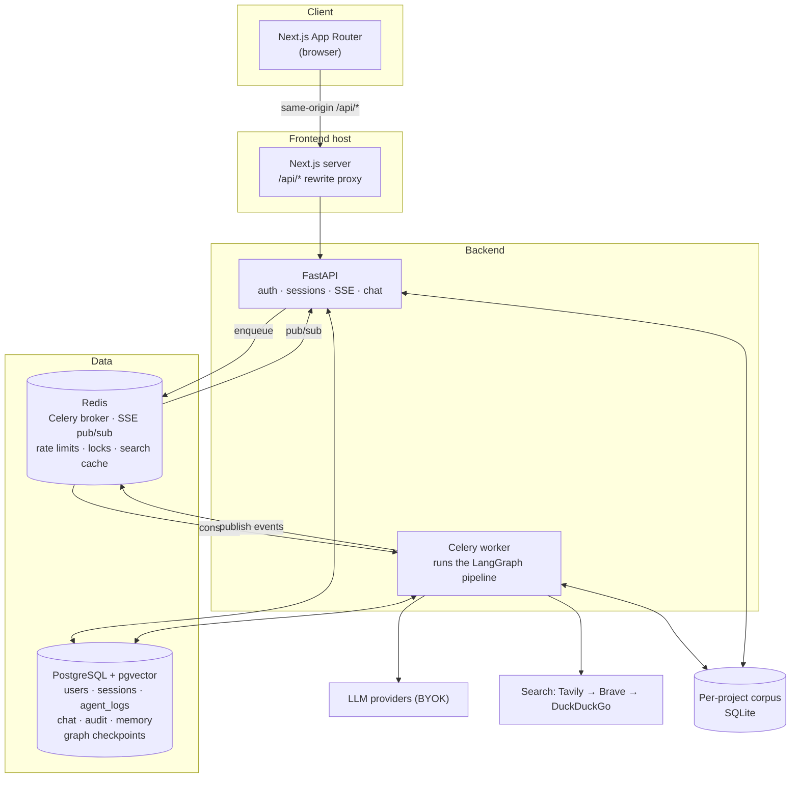

# System architecture

How the pieces fit together, and why the boundaries fall where they do.

## Topology



## The same-origin proxy

The Next.js app proxies `/api/*` to FastAPI via a rewrite. Every consequence is intentional:

- **Auth cookies are first-party** (`httpOnly`, `SameSite=Lax`). No token in web storage, no
  CORS-with-credentials configuration.
- **Native `EventSource` works**, because cookies are sent automatically. That removes the
  entire class of "EventSource cannot send an `Authorization` header" failures.
- **The backend never needs to be publicly exposed.** Only the frontend host is.

In development the frontend runs on port 3031 as a separate origin, so CORS is enabled for
exactly that origin and nothing else. In production there is no CORS middleware at all.

## Why a worker at all

Research runs take minutes and pause for humans. Doing that in a request would mean holding
an HTTP connection open across a coffee break.

Splitting it buys three things that matter more than the operational cost:

1. **The gate can outlive the process.** The graph checkpoints and the worker exits. Nothing
   is holding state in memory while it waits for you.
2. **The API stays responsive** under a load that is entirely I/O against slow third parties.
3. **The worker scales independently** of the API, and per-session locks already make extra
   concurrency safe.

## Request lifecycle

```mermaid
sequenceDiagram
  participant B as Browser
  participant A as API
  participant R as Redis
  participant W as Worker
  participant P as Postgres

  B->>A: POST /research (query, depth)
  A->>P: INSERT session (PENDING)
  A->>R: enqueue run_agent_pipeline
  A-->>B: 202 {session_id}
  B->>A: GET /research/{id}/stream (SSE, cookie auth)
  A->>P: replay agent_logs after Last-Event-ID
  A->>R: SUBSCRIBE session:{id}:events

  W->>R: acquire session lock (token, TTL > task timeout)
  W->>P: status = RUNNING
  W->>W: planner
  W->>P: checkpoint; status = AWAITING_PLAN
  A-->>B: SSE PLAN_READY → stream closes
  B->>A: POST /research/{id}/plan (edited tasks + outline)
  A->>P: INSERT audit_log (plan_approved, hash)
  A->>R: enqueue resume_plan_gate

  loop research rounds
    W->>W: executor(tools) → critic
    W->>P: INSERT agent_log
    W->>R: PUBLISH event
    R-->>A: event
    A-->>B: SSE frame
  end
  W->>W: contradiction detector → synthesizer
  W->>P: checkpoint + draft + sources; status = AWAITING_APPROVAL
  A-->>B: SSE HITL_READY → stream closes

  B->>A: POST /research/{id}/approve
  A->>P: INSERT audit_log (action, sha256(draft))
  A->>R: enqueue resume_agent_pipeline
  W->>P: resume FROM CHECKPOINT → finalizer
  W->>P: status = COMPLETED, final_report
```

The load-bearing detail: **resume enters the graph at the gate**, not at the planner. A
regression test asserts the planner is invoked exactly once across submit and approve.

## Session state machine

```
PENDING → RUNNING → AWAITING_PLAN → RUNNING → AWAITING_APPROVAL ⇄ RUNNING (rework)
                                                     │
                                                     └→ (approve) RUNNING → COMPLETED

Any state → FAILED (reason recorded; terminal)
```

`AWAITING_PLAN` is a distinct status from `AWAITING_APPROVAL` rather than a shared "paused",
because the two gates resume with different payloads. A client that could not tell them
apart would offer "approve draft" for a draft that does not exist yet.

Transitions are performed by the **worker only**, inside one database-session scope per task
run. The API changes session state in exactly two places: to `FAILED` when a user cancels,
and to `RUNNING` when a gate decision is submitted — both immediately before enqueueing the
resume, so the human's decision is durable even if the worker then dies.

## Real-time layer

| Concern | Design |
|---|---|
| Transport | SSE (`text/event-stream`) through the same-origin proxy; native `EventSource` |
| Auth | Session cookie, sent automatically. No tokens in URLs, ever |
| Durability | Events are rows in `agent_logs` **first**, Redis pub/sub second. Connect replays from the database, then tails live. `Last-Event-ID` uses the log row id |
| Ordering | The subscription opens *before* the backlog snapshot, so an event published in the gap is queued rather than lost, and de-duplicated against the replay by id |
| Termination | The stream closes on `COMPLETED`, `FAILED`, `PLAN_READY`, or `HITL_READY` — at a gate the graph is suspended and will publish nothing until a human acts |
| Chat streaming | `POST` endpoints stream SSE consumed by a buffered `fetch` reader, because `EventSource` cannot POST |

Full contract: [SSE protocol](../reference/35-sse.md).

## Concurrency and idempotency

- **Session lock** — Redis `SET NX` with a unique run token, TTL longer than the task hard
  timeout. Release is compare-and-delete in Lua, so a worker can only release a lock it
  still owns. A worker that cannot acquire the lock drops the task; the holder owns it.
- **Celery tasks do not auto-retry.** A timed-out or crashed pipeline is `FAILED` with a
  reason; resume is explicit and checkpoint-based. Automatically retrying non-idempotent,
  expensive work is how you turn one failure into a bill.
- **Resume** carries the decision on a distinct task. Resuming without a checkpoint is an
  error, recorded, not a silent restart.

## Cost and budget control

Token usage is read from each model response and accumulated in graph state, persisted at
every checkpoint. Guards are evaluated on the graph's conditional edges, so a breach routes
to a failure node that preserves partial results and records which limit was crossed and by
how much.

**Every limit is `0 = unlimited`, and `0` is the default.** The rule has two homes — the
budget check and the parallel-execution guard — and both must agree, because a naive `>=`
reads a zero limit as "already exceeded" and would skip every task at zero spend.

Prices come from a catalog, never estimated. An unpriced routed model refuses to boot rather
than defaulting to zero, because a silent zero turns the cost cap into a no-op. The
exceptions are stated where they bite: `openrouter` and `custom` serve model ids the catalog
cannot know, so they are exempt from that check — and consequently the cost cap does not
bind on them at all.

## Technology choices

| Layer | Technology | Why |
|---|---|---|
| Language | Python 3.11+ | Async maturity, typing, ecosystem |
| API | FastAPI | Async-native, Pydantic v2, OpenAPI out of the box |
| **Agent orchestration** | **LangGraph** | Real `StateGraph`, conditional edges, `interrupt()` for human gates, and Postgres checkpointing. The load-bearing choice: checkpoint-resume is what makes the gate correct rather than a polling loop |
| Checkpointer | `langgraph-checkpoint-postgres` | Durable graph state in the database already running; resume survives worker restarts |
| LLM abstraction | `langchain-core` + provider packages | Uniform tool-calling and structured output across providers |
| Search | Tavily → Brave → `ddgs` | Ordered fallback. The keyless one is last resort, never the sole retriever |
| Page fetching | httpx + BeautifulSoup + lxml | Async fetch behind the SSRF guard |
| Database | PostgreSQL with **pgvector** | Relational core, JSONB, graph checkpoints, and memory vectors in one place |
| ORM / migrations | SQLAlchemy 2.0 async + Alembic | Alembic is the single source of schema truth; no `create_all` in app code |
| Queue | Celery + Redis | Boring, proven background execution |
| Cache / pub-sub | Redis | SSE fan-out, rate limits, locks, search cache |
| Auth | PyJWT + bcrypt directly | passlib is unmaintained and conflicts with modern bcrypt |
| Logging | structlog | JSON logs with `session_id` bound through the whole run |
| PDF | WeasyPrint | Server-side Markdown → HTML → PDF |
| Frontend | Next.js App Router, React, Tailwind v4 | Server components plus the rewrites proxy give same-origin API and first-party cookies |
| Server state | TanStack Query | All reads and mutations; no hand-rolled fetch-in-effect |
| Markdown | react-markdown + remark-gfm | Safe by default; raw-HTML escape hatches are CI-banned |
| Desktop | Tauri shell + PyInstaller sidecar | Ships the same engine with SQLite and no server |

Deliberately rejected: `localStorage` tokens (XSS-exfiltratable, and incompatible with
`EventSource` auth); `create_all` at startup (it once masked an empty migration); a
hand-rolled agent loop; and Kubernetes manifests, until a real scaling need exists.

## Failure modes

| Failure | Behaviour | Why it is safe |
|---|---|---|
| Worker dies mid-run | Lock expires; the session is resumable from its last checkpoint | No partial state is committed outside a transaction |
| Two workers, one session | The second exits immediately | `SET NX` token lock, released only by its owner |
| Malformed structured output | Planner retries once then fails; **critic fails closed**; executor falls back to a tool-free structured retry | No silent pass, no silent empty evidence |
| Every retriever fails | The executor gathers nothing and the report states it plainly | Fluent-but-baseless output is the thing being prevented |
| SSE connection drops | Browser reconnects with `Last-Event-ID`; the backlog replays | Durable event log |
| SSE buffered by a proxy | `no-transform` prevents it, **and** 5-second polling converges regardless | Two independent nets — this failure was real |
| A user's stored key is undecryptable | Falls back to the server key, logs a warning, prompts re-entry | Degrade, never crash |
| Monthly token limit reached | `402` before enqueue, with the numbers | No half-run charged against a cap |
| Redis flushed | Queues, caches and rate limits are lost; **no user data is** | Everything durable lives in Postgres |

## Scaling path

Single host today. In the order you would actually hit them:

1. **Worker concurrency.** Per-session locks already make this safe. The first real
   bottleneck is provider rate limits, not CPU.
2. **Shared retrieval cache.** Already per-normalised-query; sharing it across users is the
   cheapest quality-and-cost win available.
3. **Read replica**, moving history and list endpoints off the primary.
4. **Multiple API replicas.** Redis pub/sub is already broadcast and replay comes from
   Postgres, so this works unchanged.
5. **Queue partitioning**, when one heavy user should not delay others.

Deliberately not built: Kubernetes manifests, autoscaling, sharding. There is no scaling
need that justifies the operational cost, and building for one that does not exist is the
kind of architecture this project rejects on principle.

## Observability

Structured JSON logs to stdout, every line carrying `session_id`. The `agent_logs` table
**is** the run trace and is replayable after the fact. `/health` (liveness) and
`/health/ready` (database and Redis reachable) drive the compose healthchecks that gate the
worker and frontend on migrations having run.

LangSmith tracing is available and off by default. Prometheus metrics are
[planned](../project/10-roadmap.md), marked as such rather than half-implemented.
