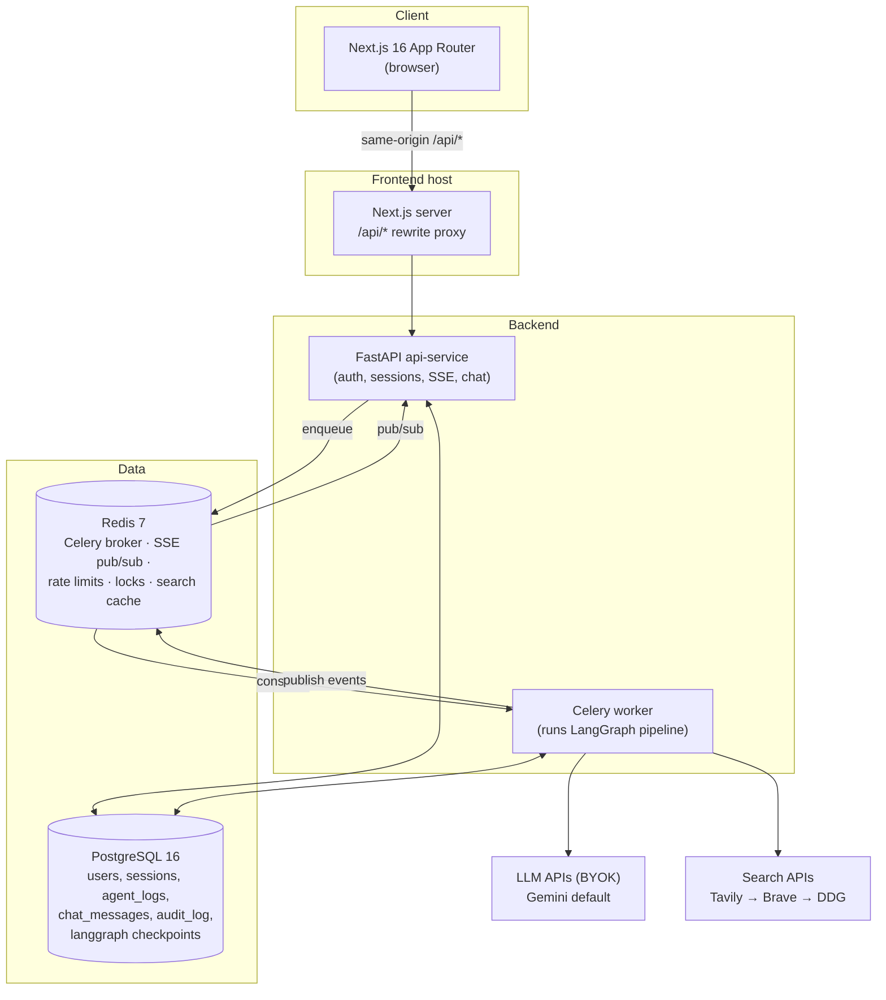

# 02. System Architecture

> Describes the system as designed for v1. Anything not yet built is marked
> **[PLANNED]** with its milestone.

## 1. Topology



**Key decision — same-origin proxy.** The Next.js app proxies `/api/*` to the FastAPI
service (Next.js `rewrites`). Consequences, all intentional:

- Auth cookies are **first-party** (`httpOnly`, `SameSite=Lax`) — no token in
  `localStorage`, no CORS-with-credentials configuration.
- Native `EventSource` works for SSE because cookies are sent automatically. This
  removes the entire class of "EventSource can't send Authorization headers" failures
  that broke the previous iteration.
- The backend never needs to be exposed publicly; only the frontend host is.

## 2. Request lifecycle: a research session

1. `POST /api/v1/research` — API validates, creates `sessions` row
   (status `PENDING`), enqueues `run_agent_pipeline(session_id)`, returns `202` with the
   session id. Rate limit: research-specific key (see [06](../engineering/06_Security.md)).
2. Browser navigates to the session page and opens
   `GET /api/v1/research/{id}/stream` (SSE, cookie-authed via proxy). On connect the
   API first **replays persisted `agent_logs`** for the session (so refresh/late-join
   loses nothing), then subscribes to the Redis channel for live events.
3. Worker picks up the task, acquires the session lock (token-based, TTL ≥ task hard
   timeout), sets status `RUNNING`, and invokes the **compiled LangGraph** with a
   Postgres checkpointer. Every node emits events that are (a) written to `agent_logs`
   and (b) published to Redis for live SSE fan-out.
4. The graph runs Planner → per-task Executor(+tools) → Critic loops → Synthesizer,
   then hits the HITL gate: LangGraph `interrupt()` persists the checkpoint and the
   worker exits cleanly. API-side, status becomes `AWAITING_APPROVAL`; the SSE stream
   delivers `HITL_READY` and closes.
5. `POST /api/v1/research/{id}/approve` with `{approved, feedback?}` — recorded in
   `audit_log`, then a resume task is enqueued. The worker **resumes from the
   checkpoint** (never from the start): approve → finalizer node → status `COMPLETED`;
   reject → synthesizer re-runs with feedback → HITL gate again.
6. Completed sessions expose the report, sources, export endpoints, and chat.

## 3. Session state machine

```
PENDING → RUNNING → AWAITING_APPROVAL → RUNNING (rework) → AWAITING_APPROVAL …
                          │
                          └→ (approve) RUNNING → COMPLETED
Any state → FAILED (reason recorded; terminal)
```

Transitions are performed **only** by the worker (single writer), inside one database
session scope per task run. The API changes session state in exactly one place:
`FAILED` on enqueue errors. All transitions are asserted by tests
([08](../engineering/08_Testing_and_Quality.md)).

## 4. Agent pipeline (summary — full contract in [04](04_Agent_Design.md))

- Real `langgraph.StateGraph`, compiled with `AsyncPostgresSaver` checkpointing.
- Executor is a tool-calling loop (`ToolNode`): the model's tool calls are executed
  and fed back until it produces a final structured answer.
- All inter-node payloads are validated Pydantic models via structured output.
  **Parse failure = node failure = retry once = then session FAILED.** Never fail open.
- HITL implemented with LangGraph `interrupt()` — resume enters the graph exactly where
  it paused.
- Hard budget guard: cost and wall-clock caps checked at every conditional edge.

## 5. Real-time layer

| Concern | Design |
|---|---|
| Transport | SSE (`text/event-stream`) via the same-origin proxy; native `EventSource` |
| Auth | Session cookie (httpOnly) — sent automatically; no tokens in URLs, ever |
| Durability | Events are rows in `agent_logs` first, Redis pub/sub second. Connect = replay from DB, then live tail. `Last-Event-ID` supported using the log row id |
| Event contract | Typed events (`agent_log`, `HITL_READY`, `COMPLETED`, `FAILED`) — schema in [05](05_Data_and_API.md) |
| Chat streaming | `POST /chat` returns an SSE `StreamingResponse` consumed via `fetch` + buffered reader (UTF-8-safe, boundary-safe parsing per [07](../product/07_UIUX_Guidelines.md) §7) |

## 6. Concurrency & idempotency

- **Session lock**: Redis `SET NX` with a unique run token, TTL = task hard timeout
  + 60s. Release is compare-and-delete (Lua). A worker that cannot acquire the lock
  logs and drops the task (the holder is responsible for the session).
- **Celery**: `acks_late=False` for the pipeline task (a crashed run is resumed from
  the LangGraph checkpoint by an explicit retry, not by broker redelivery of a
  non-idempotent task). Soft/hard time limits derive from one setting; hitting the soft
  limit marks the session FAILED — it never triggers an automatic full-pipeline retry.
- **Resume**: approval/rework enqueues a distinct `resume_agent_pipeline` task carrying
  the decision; resume without a checkpoint is an error (FAILED, message recorded).

## 7. Cost & budget control

- Token usage read from each model response's `usage_metadata`; accumulated per session
  in graph state; persisted on every checkpoint.
- `MAX_COST_PER_SESSION_USD` (default 0.50) and `MAX_WALLCLOCK_SECONDS` (default 600)
  enforced at conditional edges; exceeding either → graceful FAILED with partial
  results preserved and reason surfaced in UI.
- Costs computed from a versioned price table in config (`model → $/1M tokens`), which
  must be reviewed when models change ([03](03_Tech_Stack.md) upgrade policy).

## 8. Observability

- `structlog` JSON logs everywhere; every log line carries `session_id` and `node`.
- LangSmith tracing optional via env (`LANGCHAIN_TRACING_V2`).
- `/health` (liveness: process up) and `/health/ready` (readiness: DB + Redis ping).
- **[PLANNED M4]** Prometheus `/metrics` (pipeline duration, node latency, retriever
  fallback counts, cost per session).
