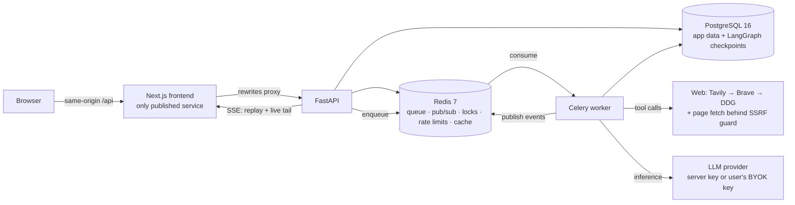
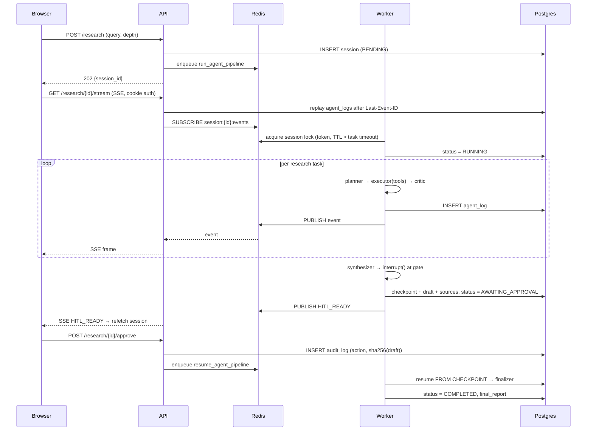

# 01 · The End-to-End System

> Everything about this project in one document: who it's for, what it does, how to use
> it, how it's built, a principal-engineer-level technical review, and an honest
> assessment of what's novel and what isn't.

---

## 1. The problem

LLMs answer research questions fluently and unverifiably. The failure isn't that they're
wrong often — it's that **wrong and right look identical**. A confident paragraph with no
provenance costs more to check than to write yourself, which is why "AI research" output
rarely survives contact with anyone accountable for the claims.

Three specific failures:

1. **No provenance.** "Studies show X" — which studies? A citation you can't click is
   decoration.
2. **No checkpoint.** The system decides when it's done. There's no moment where a human
   inspects the evidence *before* the artifact becomes the deliverable.
3. **No honest failure.** When retrieval returns nothing, a fluent model writes a
   confident report anyway. Silence would be more useful.

## 2. What this system is

A self-hostable research assistant where **a human approves before anything is final** and
**every claim is traceable to a source snippet**.

```
Query → Planner → Executor ⇄ Critic → Synthesizer → ⏸ HUMAN GATE → Finalizer → Report
                  (tools)   (fail-closed)  (cited draft)   ↑                    (+chat, export)
                                                    approve / rework
```

Concretely, it is:

- A **compiled LangGraph `StateGraph`** with Postgres checkpointing, not an orchestration
  `while` loop.
- A **FastAPI + Celery** backend with a Postgres/Redis data plane.
- A **Next.js** frontend with a live "brain monitor", a review gate, and citation UX.
- **BYOK**: users supply their own provider key, encrypted at rest, scoped per run.

### The non-goals (deliberate)

Scope discipline is part of the design. This is **not** a chatbot, a general agent
platform, a RAG-over-your-documents product, or a multi-tenant SaaS with billing. Those
are in [../01_Product_Vision.md](../product/01_Product_Vision.md) as a binding out-of-scope list,
because the failure mode of a project like this is becoming four half-products.

---

## 3. Stakeholders

| Stakeholder | What they need | How the system serves it | Where it's implemented |
|---|---|---|---|
| **Researcher / analyst** (primary user) | An answer they can defend in a meeting | Cited report; hover any `[n]` for the verbatim supporting snippet; grounded follow-up chat; `.md`/`.pdf` export | `lib/citations.tsx`, `services/export.py` |
| **Reviewer / approver** (may be the same person, different hat) | To see the evidence *before* the artifact is final, and for that decision to be recorded | HITL gate with source count, cost, rework budget; every decision writes an `audit_log` row with a **SHA-256 of the exact draft approved** | `api/v1/research.py::approve_or_rework`, `models/audit_log.py` |
| **Operator / self-hoster** | To run this without leaking keys or getting a surprise bill | One-command compose; migrations on start; per-session cost ceiling; per-user monthly token limits; BYOK so users spend their own money | `docker-compose.full.yml`, `config.py`, `services/usage.py` |
| **Security reviewer** | To approve it for a network with real data | Threat model, SSRF guard, untrusted-content framing, cookie auth with rotation + reuse detection, encrypted BYOK, strict CSP | [../06_Security.md](../engineering/06_Security.md), `agent/net_guard.py` |
| **Engineer inheriting it** | To change it without fear | Specs that match the code, 69 backend + 39 frontend tests, named regression tests per historical bug, eval baseline | `docs/`, `backend/tests/`, `backend/evals/` |
| **Interviewer / reviewer of the author** | Evidence of judgment, not just output | This folder; the bug post-mortems in [04](04_Interview_Defense.md) | — |

## 4. Applications

Where the human-gate + citations shape actually earns its cost:

- **Competitive and market scans** — the citation table is the deliverable as much as the
  prose; a claim about a competitor needs a link.
- **Technical due diligence** — "what are the trade-offs of X?" where being confidently
  wrong is expensive and the reviewer must see sources.
- **Literature triage** — first-pass survey with real links, before a human reads deeply.
- **Internal policy/compliance drafting** — the `audit_log` hash proves *which* draft a
  named user approved and when.
- **Teaching/critique of agent systems** — a compact, readable, fully-wired reference for
  checkpointed HITL.

Where it is **not** the right tool: real-time/breaking news (retrieval lags), anything
requiring paywalled primary sources, or math/computation (there's no code-execution tool).

---

## 5. How to use it

### Run it

```bash
cp .env.example .env
# JWT_SECRET_KEY=$(openssl rand -hex 32), plus a provider key —
# or LLM_MODE=fake for a keyless deterministic demo.
docker compose -f docker-compose.full.yml up --build
```

Open `http://localhost:3000`. The API container applies migrations before serving; the
worker and frontend gate on its `/health/ready`. The frontend is the only published
service and proxies `/api/*` internally, so cookies stay first-party.

### The loop

1. **Ask** — question + depth (`fast` / `balanced` / `comprehensive`). Depth sets how many
   research tasks the planner creates, so it is the main cost dial.
2. **Watch** — the pipeline rail and live feed stream every node event over SSE, with
   durable replay: reconnect and you lose nothing.
3. **Review** — at the gate you see the draft, source count, cost so far, and rework
   budget. Approve, or send feedback back to the synthesizer.
4. **Verify** — hover any `[n]` for title, domain, and the verbatim snippet. Unresolvable
   markers render ⚠.
5. **Use** — grounded follow-up chat, `.md` / `.pdf` export.
6. **Account** — Profile (name, photo, email, password) and Settings (usage, BYOK key,
   spending limit, appearance).

---

## 6. System architecture

### Containers



**Why the frontend is the only public service.** It isn't cosmetic. The `rewrites` proxy
makes the API same-origin, which means auth can be **httpOnly cookies** — and cookies are
what let native `EventSource` authenticate. The previous iteration used `localStorage`
tokens, which are XSS-exfiltratable *and* cannot authenticate `EventSource`. One
architectural choice removes an entire vulnerability class and unblocks live streaming.

### Request → report, end to end



The load-bearing detail: **resume enters the graph at the gate**, not at the planner. The
regression test `test_resume_enters_graph_at_gate` asserts the planner is invoked exactly
once across submit + approve.

---

## 7. Technical review — for a Principal AI Engineer

This section assumes you've built agent systems and want the decisions, the trade-offs,
and the parts that are genuinely hard.

### 7.1 Why a compiled graph instead of an orchestration loop

The previous iteration of this project used a hand-rolled `while` loop "simplified for
M1". It shipped four critical defects: tool calls that never executed, an approval that
couldn't complete a session, DB writes on a closed session, and an unauthenticated event
stream. That's the empirical case, but the structural case is stronger:

- **`interrupt()` is a first-class pause.** The graph durably checkpoints and the worker
  process exits. Approval hours later resumes the same state. In a hand-rolled loop, HITL
  becomes "poll a flag and hope the process is alive", which is a different (worse)
  program.
- **Budgets belong on edges, not in `if` statements.** `route_after_critic` consults
  `_over_budget(state)` — cost, token, and wall-clock ceilings — as a routing decision.
  It's one place, and it can't be forgotten at a new call site.
- **Retry topology is explicit.** Executor ⇄ Critic with `max_critic_loops` is a visible
  cycle in the graph, not nested control flow.

**Trade-off, stated honestly:** LangGraph is a heavy dependency with real API churn, and
`AsyncPostgresSaver` requires `psycopg` while the app uses `asyncpg` — two Postgres
drivers in one process. That cost bought durable HITL, which is the product.

### 7.2 The critic fails closed — the single most important safety property

```python
parsed, cost, i, o = await _structured("critic", messages, CriticVerdict)
if parsed is None:
    verdict = CriticVerdict(passed=False, confidence=0.0,
                            reasons=["critic output invalid — failing closed"], ...)
```

The default failure mode of LLM-as-judge is **fail-open**: the judge returns malformed
JSON, the `except` swallows it, and the pipeline treats "no verdict" as "no objection".
Quality gates that fail open are worse than no gate, because they manufacture confidence.

This is a one-line policy decision with outsized consequence, and it generalizes: *in any
agent system, decide explicitly what an unparseable model response means.*

### 7.3 Evidence is structured, and the failure to structure it is now recoverable

The Executor is a bounded ToolNode loop that must end by emitting `ExecutorOutput` JSON.
Running it against a real model surfaced two ways that breaks:

1. The loop exhausts `_MAX_TOOL_ROUNDS` while still calling tools, so the last message is
   a `ToolMessage`, not the model's summary.
2. The model wraps its JSON in prose or a markdown fence.

Both originally hit `except: evidence = []` — **an entire task's research discarded with
no log line**. The run "succeeded" and produced a report that said *"no evidence was
provided"*, with 0 sources. Search had worked perfectly the whole time.

The fix has three parts, and the third is the interesting one:

- Fence/prose-tolerant parsing (`_parse_evidence`).
- A **tool-free structured-output retry** over the observations already gathered — the
  work is in hand, so don't throw it away.
- A log line (`executor_wrapup`) so the fallback is observable rather than silent.

**Generalizable lesson:** every `except: pass` around a model response is a place where
the system can succeed loudly while producing nothing. Loud degradation beats silent
emptiness.

### 7.4 Citations as a verifiable data structure, not a prompt instruction

Most systems "ask nicely" for citations in the prompt. Here the Synthesizer receives a
pre-numbered evidence table built in code from unique evidence URLs:

```python
sources.append(Source(index=n, url=url, title=..., snippet=...).model_dump())
```

The model writes `[n]` markers against a table it did not invent. The frontend then walks
the rendered HAST (not a regex over the markdown string, so code spans stay intact) and
resolves each marker against that table. **A marker with no matching source renders as a
visible ⚠ chip.**

That last decision is the philosophical core: the system is built to **surface its own
failures**. Hiding an unresolved citation would make the output look better and be worth
less.

### 7.5 The durability seam: SSE that survives reconnects — and the compression trap

Live agent output is a streaming problem with a persistence requirement. The design:
every node event is written to `agent_logs` **and then** published to Redis. The SSE
endpoint replays the durable backlog (honoring `Last-Event-ID`) *before* tailing live
pub/sub, and the client de-dupes on the durable row id.

This is what makes reconnects lossless — and it's also why the system could be debugged at
all when the transport broke.

**And the transport did break, invisibly.** Next.js gzips responses by default, and
compression **buffers a `text/event-stream` body** while filling its window. Response
headers arrived, `EventSource` reported an open connection, and *zero* events were
delivered. The live monitor sat on "Waiting for the pipeline to start…" while the pipeline
ran perfectly. Reproduced precisely:

| `Accept-Encoding` | Bytes in 4s |
|---|---|
| `identity` | 40 (instant) |
| `gzip, deflate, br` (every browser) | 10, then timeout |

Fix: `Cache-Control: no-transform` — the HTTP-standard instruction that compressing
intermediaries (Next's `compression` middleware, nginx, CDNs) all honor. One header, one
shared constant, one regression test, rather than disabling compression app-wide.

**Lesson worth internalizing:** *a healthy-looking connection is not a working connection.*
Any streaming feature needs an end-to-end test through the real client stack; API-level
polling tests will pass while the actual product is dead.

### 7.6 Defense in depth for a fundamentally injectable system

An agent that reads the open web is a prompt-injection surface by construction. Layers:

- **SSRF guard** on `read_webpage`: resolve DNS, then reject loopback / RFC1918 /
  link-local / cloud-metadata ranges — checked **after** resolution, so a hostname
  resolving to `169.254.169.254` doesn't slip through.
- **Untrusted-content framing**: every web payload enters the prompt inside
  `<untrusted_web_content>` tags.
- **Role integrity**: chat history replays assistant turns as `AIMessage`, never
  `SystemMessage`. Model output must never gain system authority.
- **Rendering**: `react-markdown` with no `rehype-raw`, CI-guarded by a grep.

None of these is individually clever. The point is that they're all present and each is
tested, because injection defense is an AND, not an OR.

### 7.7 BYOK isolation

Per-user keys are the difference between a demo and something you can expose publicly.
The chain: Fernet ciphertext at rest (HKDF-derived key, domain-separated from JWT signing)
→ decrypted only inside the worker for that user's run → held in a **`ContextVar`** so
concurrent runs in one worker process cannot read each other's key → never returned by any
endpoint, never logged, surfaced only as a `…aB3d` hint.

The `ContextVar` (rather than a module global) is the detail that matters: Celery
prefork + async means several users' runs can share a process. A global would be a
cross-tenant key leak.

### 7.8 Cost accounting that is real

Cost comes from `usage_metadata` on actual responses against a versioned price table, and
a routed model with no price entry **fails at startup** rather than silently costing
$0.00. The budget guard then reads real numbers. A system that can't price itself can't
be given a budget.

### 7.9 Where the design is weakest (honest)

- **Evidence dedup is URL-exact.** The same article at two URLs becomes two sources.
- **The critic judges per-task evidence, not the final report.** Nothing re-checks that
  the synthesizer's `[n]` usage is faithful to the snippet it points at — the eval harness
  measures this offline, but it isn't a runtime gate.
- **Multi-citation rendering.** `[3, 11, 18]` stays plain text; only single `[n]` markers
  become chips.
- **Retrieval quality is the ceiling.** With no Tavily/Brave key, DuckDuckGo is
  rate-limited and slow, and report quality tracks retrieval quality more than model
  quality.
- **One worker, one lock.** Fine to a few concurrent sessions; beyond that it needs
  queue-per-tenant and concurrency tuning.

---

## 8. Why this is a novel project

Being precise, because "novel" is easy to overclaim.

**Not novel:** multi-agent decomposition, RAG-style retrieval, LLM-as-judge, human-in-the-
loop as a concept, cited output as a goal.

**Genuinely uncommon, especially together:**

1. **HITL as a durable graph checkpoint.** Most "human in the loop" implementations are a
   status flag plus a polling loop; the process must survive, and approval re-runs work.
   Here the gate is `interrupt()`, state lives in Postgres, and approval **resumes** —
   asserted by a test that the planner runs exactly once across submit + approve.
2. **Citations built as a data structure and validated in the renderer**, with unresolved
   markers rendered as visible failures. The system is designed to *show* its errors.
3. **Fail-closed quality gating** as an explicit, tested policy rather than an accident of
   exception handling.
4. **Per-user BYOK with `ContextVar` isolation inside a shared worker** — the piece that
   makes public deployment defensible.
5. **A quality baseline that is committed and diffable.** `make eval` scores a versioned
   query set and writes dated JSON, so "did that prompt change help?" is answerable.
6. **Specs and code that match, with named regression tests per historical bug.** The
   docs are the contract, not marketing.

**The most honest novelty claim:** this is a complete, deployable, *debugged* reference
for checkpointed human-in-the-loop research — including the failure modes that only appear
when you run it against real models and a real browser. Most public examples stop at the
happy path in a notebook. The gzip/SSE bug and the silent-evidence-drop bug are the kind
of thing you only find by shipping, and both are documented with their reproductions in
[04_Interview_Defense.md](04_Interview_Defense.md).

---

## 9. Current state

| Area | Status |
|---|---|
| Pipeline (LangGraph, checkpointed HITL, budgets) | ✅ Verified end-to-end against real models |
| Auth, rate limits, SSRF, BYOK encryption | ✅ Tested |
| Frontend (five session states, citations, SSE, account) | ✅ Verified in a real browser |
| Packaging (images, compose, migrate-on-start) | ✅ Full stack runs from one command |
| Eval harness + committed baseline | ✅ Fake-mode baseline; real-model run pending keys |
| Tests | ✅ 69 backend, 39 frontend, 3 Playwright golden journeys |
| `v1.0.0` tag / GHCR publish | ⏳ Deliberately not done — needs green CI on `main` |

Real verified run: **18 sources** (arXiv, Wikipedia, Meilisearch, Microsoft Learn), a
10,957-character report with **all 18 citations resolving**, $0.027 and 193k tokens,
`.md` + real `%PDF` export, and grounded follow-up chat.
