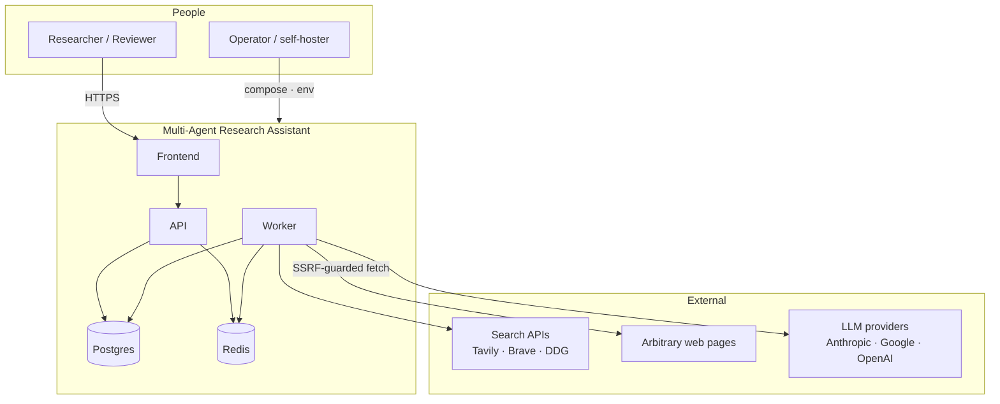
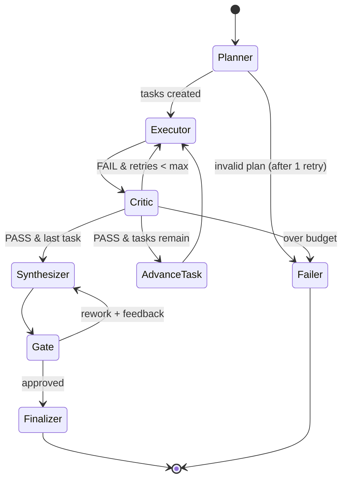
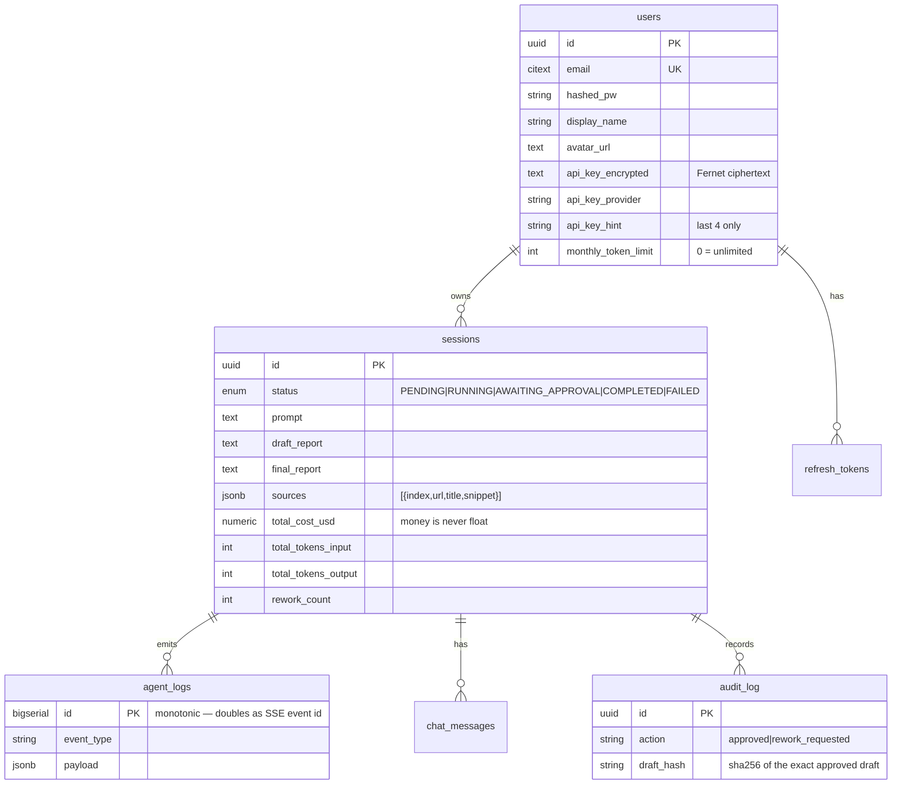

# 02 · High-Level Design (HLD)

> Boundaries, flows, data, and failure behavior. The "what and why" at system altitude —
> module internals are in [03_LLD.md](03_LLD.md).

---

## 1. Design principles

Five rules that explain most decisions downstream:

1. **Durable over in-memory.** Anything a human waits on survives a process restart —
   graph state, events, sessions. Redis is disposable by design; Postgres is truth.
2. **Fail closed.** Ambiguity resolves to "not approved" / "not passed" / "no key". An
   unparseable judge is a failure, not a pass.
3. **Surface failure, don't smooth it.** Unresolvable citations render ⚠; degraded
   retrieval is explicit; empty evidence produces a report that says so.
4. **One published surface.** Only the frontend is exposed. Same-origin makes cookie auth
   viable, which makes native `EventSource` auth viable.
5. **Schema is owned by migrations.** No `create_all`, ever — that masked an empty
   migration in a previous iteration.

## 2. Context



**Trust boundaries.** Everything from `Search APIs` and `Arbitrary web pages` is untrusted
input that reaches an LLM prompt — the primary injection surface. LLM providers are
trusted for availability but not for output shape, which is why every structured response
is validated and fails closed.

## 3. Containers and responsibilities

| Container | Responsibility | Explicitly not responsible for |
|---|---|---|
| **Frontend** (Next.js 16) | Rendering, session UX, citation resolution, same-origin `/api` proxy | Business rules, auth decisions, calling LLMs |
| **API** (FastAPI) | AuthN/Z, validation, rate limits, session CRUD, SSE fan-out, exports, enqueueing | Running the pipeline (never blocks a request on inference) |
| **Worker** (Celery) | The graph run: planning, tools, critique, synthesis, checkpointing, event emission | Serving HTTP |
| **Postgres 16** | Users, sessions, agent_logs, chat, audit, refresh tokens, **LangGraph checkpoints** | Ephemeral coordination |
| **Redis 7** | Queue broker, SSE pub/sub, session locks, rate limits, search cache | Anything durable — a flush must never lose user data |

**Why the API never runs the pipeline:** a research run is minutes long. Doing it in a
request handler couples run duration to HTTP timeouts and makes deploys destructive. The
API's job is to be fast and boring.

## 4. The five critical flows

### 4.1 Start research

```
POST /research
  → rate limit (per-operation, atomic Lua)
  → monthly token limit check (402 if exceeded — before enqueue, not mid-run)
  → INSERT session (PENDING)
  → enqueue run_agent_pipeline
  → 202 {session_id}
```

Both guards run *before* enqueueing so a capped user gets a clear error rather than a
session that dies halfway.

### 4.2 Pipeline execution



Budget checks (`cost_usd`, `tokens_input`, wall-clock) live on the conditional edge out of
Critic, so no node can forget them.

### 4.3 The human gate (the differentiator)

```
Synthesizer → interrupt({type: HITL_READY, word_count, source_count, cost_usd})
  → LangGraph persists checkpoint (thread_id = session_id)
  → worker writes draft + sources, status = AWAITING_APPROVAL, releases lock, exits
  ...hours may pass; no process is held open...
POST /approve {approved, feedback?}
  → 409 unless AWAITING_APPROVAL   (idempotence against double-submit)
  → 409 if rework and rework_count >= 3
  → INSERT audit_log(action, user, sha256(draft))   ← proves WHAT was approved
  → status = RUNNING, enqueue resume
  → worker: graph.ainvoke(Command(resume={...}), config) → re-enters AT THE GATE
```

The draft hash matters: "approved" is meaningless if the artifact can change afterward.

### 4.4 Live event streaming

```
Worker node → emit(event)
   → INSERT agent_logs (durable)      ← replay source
   → PUBLISH session:{id}:events      ← live fan-out

GET /research/{id}/stream (cookie-authed)
   → snapshot agent_logs WHERE id > Last-Event-ID     (replay first)
   → SUBSCRIBE, then tail live, skipping ids already replayed
   → terminate on COMPLETED | FAILED | HITL_READY
```

Two independent safety nets, because a stall here is invisible:

1. `Cache-Control: no-transform` prevents any compressing proxy from buffering the stream.
2. The client **polls the session every 5s while a run is active**, so even a missed
   terminal event can't strand the UI.

### 4.5 BYOK key lifecycle

```
PUT /auth/me/api-key → Fernet encrypt → store ciphertext + provider + last-4 hint
Worker run start     → load user → decrypt → set_user_keys() into a ContextVar
get_llm(role)        → user key if present, else server key, else actionable error
Run end (finally)    → reset_user_keys()
```

Never returned by any endpoint, never logged, `ContextVar`-scoped so concurrent runs in
one process are isolated.

## 5. Data model



Deliberate choices:

- **`agent_logs.id` is a bigserial** and doubles as the SSE event id — replay is a simple
  `WHERE id > last_event_id`, with no separate sequence to keep consistent.
- **`total_cost_usd` is `Numeric`, never float.** Money in binary floating point is a bug
  waiting for a rounding edge.
- **`sources` is JSONB**, not a table: it's a versioned artifact of one run, always read
  whole, never queried across sessions.
- **`ON DELETE CASCADE` + `passive_deletes`** — deleting a user cascades in the database
  rather than the ORM loading every child row, which also satisfies data-removal requests.
- **LangGraph checkpoint tables live in the same Postgres**, so one `pg_dump` captures
  complete state including in-flight runs.

## 6. Non-functional requirements

| Concern | Target | Mechanism |
|---|---|---|
| Run latency | 1–6 min (depth-dependent) | Async I/O; retrieval is the bottleneck, not inference |
| Cost per session | Hard ceiling (default $0.50) | `usage_metadata` accounting + budget edge |
| Live feed latency | < 1s node→browser | Redis pub/sub; `no-transform` |
| Reconnect loss | Zero | Durable `agent_logs` + `Last-Event-ID` replay |
| Crash recovery | Resume at gate, no re-research | Postgres checkpoints; lock TTL > task timeout |
| Auth | httpOnly cookies, 15-min access, rotating refresh, reuse ⇒ family revoke | `services/tokens.py`, `auth_service.py` |
| Multi-tenant key safety | No cross-user key visibility | `ContextVar`-scoped decryption |
| Public-deploy spend | Bounded per account | `DEFAULT_MONTHLY_TOKEN_LIMIT` + BYOK |

## 7. Failure modes

| Failure | Behavior | Why it's safe |
|---|---|---|
| Worker dies mid-run | Lock expires (TTL > task timeout); session resumable from last checkpoint | No partial state committed outside a transaction |
| Two workers, one session | Second exits immediately | `SET NX` token lock; released only by its owner (compare-and-delete Lua) |
| Model returns malformed structured output | Planner retries once then `failer`; critic **fails closed**; executor falls back to a tool-free structured retry | No silent "pass" or silent empty evidence |
| All retrievers fail | Executor gathers no evidence; report states it plainly | Fluent-but-baseless output is the thing being prevented |
| SSE connection drops | Browser reconnects with `Last-Event-ID`; backlog replays | Durable event log |
| SSE silently buffered by a proxy | Prevented by `no-transform`; **and** 5s polling converges regardless | Two independent nets — this failure was real |
| User's BYOK key undecryptable (rotated secret) | Falls back to server key, logs a warning, prompts re-entry | Degrade, never crash |
| Monthly limit hit | `402` before enqueue with reset date | No half-run charged against a cap |
| Redis flushed | Queues/caches/limits lost; **no user data lost** | Everything durable is in Postgres |

## 8. Scaling path

Current shape is a single host. In order of when you'd hit them:

1. **Worker concurrency** — Celery `--concurrency` up; per-session locks already make this
   safe. First real bottleneck is provider rate limits, not CPU.
2. **Retrieval cache** — Redis cache is per-normalized-query; a shared cache across users
   is the cheapest quality/cost win.
3. **Read replica** — history/list endpoints move off primary.
4. **SSE fan-out** — Redis pub/sub is already broadcast; multiple API replicas work
   unchanged because replay comes from Postgres.
5. **Queue partitioning** — per-tenant queues when one heavy user shouldn't delay others.

Deliberately **not** built: Kubernetes manifests, autoscaling, sharding. There's no
scaling need to justify the operational cost yet, and pretending otherwise is the kind of
resume-driven architecture this project's specs explicitly reject.

## 9. Cross-cutting concerns

**Observability.** Structured JSON logs (`structlog`) with bound `session_id`; the
`agent_logs` table *is* the run trace and is replayable after the fact; `/health` and
`/health/ready` (DB + Redis) drive compose gating. Not built: Prometheus/Grafana — marked
`[PLANNED]` rather than half-implemented.

**Testing.** Layered so each is fast and honest: unit (pure logic) → pipeline (whole graph
on scripted models, no network) → integration (real Postgres/Redis) → golden E2E (three
Playwright journeys through the packaged stack) → evals (real-model quality, offline).
`LLM_MODE=fake` is what makes the middle layers deterministic and free.

**Config.** All env, parsed by `pydantic-settings`, validated at startup: placeholder/short
JWT secret refuses to boot, a routed model with no price entry refuses to boot, production
with a routed provider missing its key refuses to boot. Fail at deploy, not at 3am.
